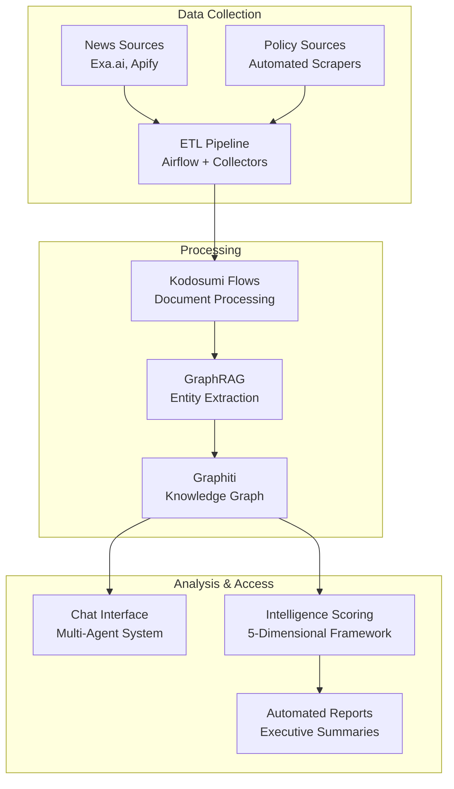

# Political Monitoring Agent v0.2.0

**AI-powered political monitoring with automated data collection, temporal knowledge graphs, and intelligent chat interface**

[](https://github.com/your-org/policiytracker)
[](https://python.org)
[](LICENSE)

## 🎯 What This System Does

Transform raw political documents into actionable intelligence through:

- **🤖 Chat Interface**: Query your political knowledge graph conversationally
- **📰 Automated Collection**: Daily news and policy document gathering via ETL pipelines  
- **🧠 Knowledge Graph**: Temporal entity tracking with relationship mapping
- **📊 Intelligence Analysis**: Multi-dimensional relevance scoring and topic clustering
- **⚡ Real-time Processing**: Distributed document analysis with Ray

## 🚀 Quick Start

**Get running in 5 minutes:**

```bash
# 1. Setup
git clone <repository-url> && cd policiytracker
just setup && just services-up

# 2. Launch
just dev

# 3. Access
# → Chat Interface: http://localhost:3000
# → Admin Panel: http://localhost:3370 (admin/admin)  
# → ETL Dashboard: http://localhost:8080 (admin/admin)
```

**Test immediately**: Upload sample documents from `data/input/examples/` via the web interface.

> 📖 **New to the system?** Start with the [User Guide](docs/USER_GUIDE.md) for step-by-step instructions.

## 🏗️ Architecture Overview



## 📂 Component Documentation

### **Core Systems**
- **[ETL Pipeline](src/etl/README.md)** - Automated data collection with Airflow, collectors, and storage
- **[Document Flows](src/flows/README.md)** - Kodosumi-based document processing workflows  
- **[Chat Interface](src/chat/README.md)** - Multi-agent conversational analysis system
- **[GraphRAG System](src/graphrag/README.md)** - Knowledge graph construction and temporal intelligence

### **Supporting Components**
- **[Scoring Engine](src/scoring/README.md)** - 5-dimensional intelligence assessment framework
- **[Testing Suite](tests/README.md)** - Comprehensive testing strategy and execution

### **Documentation**
- **[User Guide](docs/USER_GUIDE.md)** - Business user instructions and workflows
- **[Setup Guide](docs/SETUP.md)** - Complete installation and configuration
- **[Quick Reference](docs/QUICK_REFERENCE.md)** - Commands, URLs, and troubleshooting

## 🛠️ Development

### **Prerequisites**
- Python 3.12.6 (strict requirement)
- Docker & Docker Compose
- 8GB+ RAM recommended
- OpenAI API key for LLM operations

### **Common Commands**
```bash
# Development
just dev              # Start full system
just dev-quick        # Restart without rebuilding
just test             # Run test suite
just format           # Format code

# Data Operations  
just collect-news     # Manual news collection
just process-docs     # Manual document processing
just build-communities # Knowledge graph community detection

# Monitoring
just logs             # View all logs
just kodosumi-logs    # Application logs
just status           # System health check
```

### **Environment Setup**
1. Copy `.env.example` to `.env`
2. Configure API keys and storage settings
3. Run `just setup` for automated dependency installation
4. See component READMEs for detailed configuration

## 🔧 Configuration

### **Essential Settings**
- **Storage**: Azure Blob Storage or local filesystem
- **LLM Provider**: OpenAI API for analysis and chat
- **Observability**: Langfuse for prompt and performance monitoring  
- **Knowledge Graph**: Neo4j with Graphiti temporal intelligence

### **Client Context**
Configure your organization's monitoring priorities in `data/context/client.yaml`:
```yaml
company_profile:
  name: "Your Organization"
  industries: ["technology", "finance"]
  regions: ["EU", "US"]
  
priority_topics:
  - "AI regulation"
  - "data privacy"  
  - "cybersecurity"
```

> 🔧 **Detailed configuration guides** are available in each component's README.

## 📊 Use Cases

### **Compliance Teams**
- Monitor regulatory changes affecting your industry
- Track enforcement actions and policy interpretations
- Generate compliance impact assessments

### **Government Affairs**
- Track policy development across multiple jurisdictions
- Monitor stakeholder positions and influence networks
- Analyze regulatory trends and emerging issues

### **Research & Intelligence**
- Build comprehensive political knowledge bases
- Discover hidden connections between entities and events
- Generate temporal analysis of policy evolution

## 🏷️ System Tags

`#political-monitoring` `#ai-analysis` `#knowledge-graph` `#regulatory-intelligence` `#automated-etl` `#temporal-analysis` `#chat-interface` `#document-processing`

## 📞 Support & Resources

- **Documentation**: Browse component READMEs for detailed guides
- **Issues**: Check common troubleshooting in component documentation
- **Configuration**: Refer to `.env.example` and component configs
- **Performance**: See [optimization guides](docs/specs/) for production deployment

## 🤝 Contributing

1. Read component-specific development guides
2. Follow the testing standards in `tests/README.md`
3. Ensure all tests pass: `just test`
4. Format code: `just format && just typecheck`

---

**v0.2.0** - Built with Kodosumi, Graphiti, LangGraph, and Ray | [Release Notes](docs/CHANGELOG.md)