# Political Domain Schema v3.0 - Entity Relationship Diagram

## Overview
This ER diagram represents the complete knowledge graph schema for the Political Monitoring Agent, showing 20 entity types and 38 relationship types organized across 7 tiers.

## Mermaid ER Diagram

```mermaid
erDiagram
    %% ============================================
    %% TIER 1: LEGISLATIVE PROCESS (Blue)
    %% ============================================

    LegislativeProposal ||--o{ Vote : "VOTES_ON"
    LegislativeProposal ||--|| LegislativeBody : "SUBMITS_TO"
    LegislativeProposal ||--o| Policy : "BECOMES"
    LegislativeProposal ||--o| Regulation : "BECOMES"
    LegislativeProposal ||--|| Jurisdiction : "IN_JURISDICTION"
    LegislativeProposal ||--o| Policy : "TRANSPOSES"
    LegislativeProposal ||--o| LegalFramework : "REFERENCES"

    Committee ||--o| LegislativeProposal : "EXAMINES"
    Committee ||--|| Jurisdiction : "IN_JURISDICTION"

    Document ||--o| LegislativeProposal : "AMENDS_PROPOSAL"
    Document ||--o| Policy : "PRELIMINARY_REFERENCE"
    Document ||--o| Policy : "PRECEDES"

    LegislativeBody ||--o| LegislativeProposal : "PROPOSES"
    LegislativeBody ||--|| Jurisdiction : "IN_JURISDICTION"
    LegislativeBody ||--o| GovernmentAgency : "DELEGATES_TO"

    %% ============================================
    %% TIER 2: FINAL OUTCOMES (Green)
    %% ============================================

    Policy ||--|| Jurisdiction : "IN_JURISDICTION"
    Policy ||--o{ Company : "AFFECTS"
    Policy ||--o{ Industry : "AFFECTS"
    Policy ||--o{ Company : "REQUIRES_COMPLIANCE"
    Policy ||--o{ Industry : "REQUIRES_COMPLIANCE"
    Policy ||--o| Policy : "TRANSPOSES"
    Policy ||--o| Policy : "GOLD_PLATES"
    Policy ||--o| Policy : "SUPERSEDES"
    Policy ||--o| Policy : "AMENDS"
    Policy ||--o| Policy : "CONFLICTS_WITH"
    Policy ||--o| Policy : "REFERENCES"
    Policy ||--|| LegalFramework : "REFERENCES"

    Regulation ||--|| Jurisdiction : "IN_JURISDICTION"
    Regulation ||--|| Policy : "IMPLEMENTS"
    Regulation ||--o{ Company : "AFFECTS"
    Regulation ||--o{ Industry : "AFFECTS"
    Regulation ||--o{ Company : "REQUIRES_COMPLIANCE"
    Regulation ||--|| Policy : "REFERENCES"
    Regulation ||--o| TechnicalStandard : "REFERENCES"
    Regulation ||--o| Regulation : "SUPERSEDES"
    Regulation ||--o| Regulation : "AMENDS"
    Regulation ||--o| Regulation : "CONFLICTS_WITH"

    %% ============================================
    %% TIER 3: ACTORS (Orange)
    %% ============================================

    Politician ||--|| Jurisdiction : "REPRESENTS"
    Politician ||--o| LegislativeProposal : "PROPOSES"
    Politician ||--o| LegislativeProposal : "AMENDS_PROPOSAL"

    Person ||--o| LegislativeProposal : "INFLUENCES"
    Person ||--o| LegislativeProposal : "HAS_POSITION"
    Person ||--o| Policy : "INFLUENCES"
    Person ||--o| Policy : "HAS_POSITION"
    Person ||--o| ConsultationProcess : "CONTRIBUTES"
    Person ||--o| Committee : "CONTRIBUTES"
    Person ||--o| Document : "CONTRIBUTES"
    Person ||--o{ Company : "AFFILIATED_WITH"
    Person ||--o{ GovernmentAgency : "AFFILIATED_WITH"
    Person ||--o{ LobbyGroup : "AFFILIATED_WITH"

    PoliticalParty ||--|| Jurisdiction : "IN_JURISDICTION"
    PoliticalParty ||--|| Jurisdiction : "REPRESENTS"
    PoliticalParty ||--o| LegislativeProposal : "PROPOSES"
    PoliticalParty ||--o| LegislativeProposal : "INFLUENCES"
    PoliticalParty ||--o| Policy : "INFLUENCES"

    GovernmentAgency ||--|| Jurisdiction : "IN_JURISDICTION"
    GovernmentAgency ||--o| LegislativeProposal : "PROPOSES"
    GovernmentAgency ||--o{ Policy : "ENFORCES"
    GovernmentAgency ||--o{ Regulation : "ENFORCES"
    GovernmentAgency ||--o{ Company : "MONITORS"
    GovernmentAgency ||--o{ Industry : "MONITORS"
    GovernmentAgency ||--o| GovernmentAgency : "DELEGATES_TO"

    LobbyGroup ||--|| Jurisdiction : "IN_JURISDICTION"
    LobbyGroup ||--o{ Politician : "INFLUENCES"
    LobbyGroup ||--o{ Politician : "ADVISES"
    LobbyGroup ||--o| LegislativeProposal : "INFLUENCES"
    LobbyGroup ||--o| LegislativeProposal : "LOBBIES_FOR"
    LobbyGroup ||--o| LegislativeProposal : "LOBBIES_AGAINST"
    LobbyGroup ||--o| Policy : "LOBBIES_FOR"
    LobbyGroup ||--o| Policy : "LOBBIES_AGAINST"
    LobbyGroup ||--|| Industry : "REPRESENTS"
    LobbyGroup ||--o| ConsultationProcess : "ADVISES"

    %% ============================================
    %% TIER 4: BUSINESS (Purple)
    %% ============================================

    Company ||--o{ Jurisdiction : "IN_JURISDICTION"
    Company ||--o{ Jurisdiction : "OPERATES_IN"
    Company ||--o| LegislativeProposal : "LOBBIES_FOR"
    Company ||--o| LegislativeProposal : "LOBBIES_AGAINST"
    Company ||--o| Policy : "LOBBIES_FOR"
    Company ||--o| Policy : "LOBBIES_AGAINST"
    Company ||--o| Policy : "SUBJECT_TO"
    Company ||--o| Regulation : "SUBJECT_TO"
    Company ||--o{ ComplianceObligation : "SUBJECT_TO"
    Company ||--o{ Industry : "COMPETES_IN"
    Company ||--o| ConsultationProcess : "ADVISES"

    Industry ||--o{ Jurisdiction : "IN_JURISDICTION"
    Industry ||--o{ Jurisdiction : "OPERATES_IN"
    Industry ||--o{ GovernmentAgency : "INFLUENCES"
    Industry ||--o{ GovernmentAgency : "ADVISES"
    Industry ||--o| LegislativeProposal : "LOBBIES_FOR"
    Industry ||--o| LegislativeProposal : "LOBBIES_AGAINST"
    Industry ||--o| Policy : "SUBJECT_TO"
    Industry ||--o| TechnicalStandard : "SUBJECT_TO"

    ComplianceObligation ||--|| Jurisdiction : "IN_JURISDICTION"
    ComplianceObligation ||--o{ Company : "AFFECTS"
    ComplianceObligation ||--|| Policy : "IMPLEMENTS"
    ComplianceObligation ||--|| Regulation : "IMPLEMENTS"

    %% ============================================
    %% TIER 5: PROCESS TRACKING (Red)
    %% ============================================

    ConsultationProcess ||--|| Jurisdiction : "IN_JURISDICTION"
    ConsultationProcess ||--o| LegislativeProposal : "TRIGGERS"
    ConsultationProcess ||--o| LegislativeProposal : "PRECEDES"

    EnforcementAction ||--|| Jurisdiction : "IN_JURISDICTION"
    EnforcementAction ||--|| Jurisdiction : "INFRINGEMENT_AGAINST"
    EnforcementAction ||--o{ Company : "AFFECTS"
    EnforcementAction ||--o{ Industry : "AFFECTS"
    EnforcementAction ||--o| Policy : "TRIGGERS"

    %% ============================================
    %% TIER 6: GEOGRAPHIC (Yellow)
    %% ============================================

    Jurisdiction ||--o| Jurisdiction : "MEMBER_OF"
    Jurisdiction ||--o| Jurisdiction : "HARMONIZES_WITH"
    Jurisdiction ||--o| Jurisdiction : "CONFLICTS_WITH"
    Jurisdiction ||--o{ Policy : "ENFORCES"
    Jurisdiction ||--o| GovernmentAgency : "DELEGATES_TO"

    %% ============================================
    %% TIER 7: TECHNICAL/LEGAL (Cyan)
    %% ============================================

    TechnicalStandard ||--|| Policy : "IMPLEMENTS"
    TechnicalStandard ||--|| LegalFramework : "IMPLEMENTS"
```

## Entity Tiers

### Tier 1: Legislative Process
- **LegislativeProposal** - Draft legislation moving through the process
- **LegislativeBody** - Parliaments, councils, assemblies
- **Committee** - Parliamentary/council committees
- **Document** - Official documents (impact assessments, amendments, reports)
- **Vote** - Voting records on proposals

### Tier 2: Final Outcomes
- **Policy** - Final enacted laws and regulations
- **Regulation** - Implementing rules and technical regulations

### Tier 3: Actors
- **Politician** - Individual elected officials and appointees
- **Person** - Non-politician individuals (CEOs, experts, activists)
- **PoliticalParty** - Political parties and their positions
- **GovernmentAgency** - Executive agencies, regulatory bodies, ministries
- **LobbyGroup** - Interest groups, NGOs, industry associations

### Tier 4: Business
- **Company** - Individual corporations and business entities
- **Industry** - Business sectors and industry classifications
- **ComplianceObligation** - Specific requirements companies must meet

### Tier 5: Process Tracking
- **ConsultationProcess** - Public consultations and stakeholder engagement
- **EnforcementAction** - Fines, investigations, sanctions

### Tier 6: Geographic
- **Jurisdiction** - Geographic and legal jurisdictions (EU, countries, regions)

### Tier 7: Technical/Legal
- **LegalFramework** - Constitutions, treaties, framework legislation
- **TechnicalStandard** - Technical standards and specifications (ISO, EN, etc.)

## Key Relationship Categories

### Jurisdiction Relationships
- **IN_JURISDICTION** - Entity located in/associated with jurisdiction
- **MEMBER_OF** - Jurisdiction hierarchy (Bayern → Germany → EU)
- **REPRESENTS** - Politicians/parties representing jurisdictions

### Legislative Process
- **PROPOSES** - Who proposes legislation
- **SUBMITS_TO** - Proposal submitted to legislative body
- **EXAMINES** - Committee examination of proposal
- **AMENDS_PROPOSAL** - Amendments to proposals
- **VOTES_ON** - Voting on proposals
- **BECOMES** - Proposal becomes final policy/regulation

### EU-Germany Coordination
- **TRANSPOSES** - National law transposes EU directive
- **GOLD_PLATES** - National measure exceeds EU minimums
- **INFRINGEMENT_AGAINST** - Commission infringement against member state
- **PRELIMINARY_REFERENCE** - National court asks CJEU for interpretation

### Influence and Power
- **INFLUENCES** - General influence relationship
- **LOBBIES_FOR** - Active support for policy
- **LOBBIES_AGAINST** - Active opposition to policy
- **HAS_POSITION** - Public position on policy/proposal
- **CONTRIBUTES** - Expert contributions, testimony
- **AFFILIATED_WITH** - Person affiliated with organization

### Business Impact
- **AFFECTS** - Policy affects business entity
- **SUBJECT_TO** - Entity subject to regulation
- **REQUIRES_COMPLIANCE** - Specific compliance requirement
- **OPERATES_IN** - Company operates in jurisdiction
- **COMPETES_IN** - Competition relationship

### Regulatory Hierarchy
- **IMPLEMENTS** - How policy is implemented
- **ENFORCES** - Enforcement relationships
- **DELEGATES_TO** - Authority delegation

### Temporal
- **SUPERSEDES** - Policy replaces another
- **AMENDS** - Policy amends another
- **TRIGGERS** - Event triggers response
- **PRECEDES** - Sequential relationship

### Reference
- **REFERENCES** - Cross-references between documents/policies
- **HARMONIZES_WITH** - Coordination between jurisdictions
- **CONFLICTS_WITH** - Regulatory conflict

### Stakeholder
- **ADVISES** - Advisory relationships
- **MONITORS** - Oversight relationships

## Usage Notes

### Viewing the Diagram
- **GitHub/GitLab**: Will render automatically in markdown
- **VS Code**: Install "Markdown Preview Mermaid Support" extension
- **Export**: Use mermaid.live or VS Code to export as PNG/SVG

### Schema Statistics
- **Total Entities**: 20
- **Total Edge Types**: 38
- **Total Edge Patterns**: 145+ (from EDGE_TYPE_MAP)
- **Version**: 3.0 (Cleaned)
- **Last Updated**: 2025-01-13

### Key Features
- **Temporal Knowledge Graph**: Designed for Graphiti integration
- **Multi-jurisdictional**: Supports EU, national, and regional levels
- **Business-focused**: Comprehensive company impact tracking
- **Compliance-ready**: Detailed obligation and enforcement tracking
