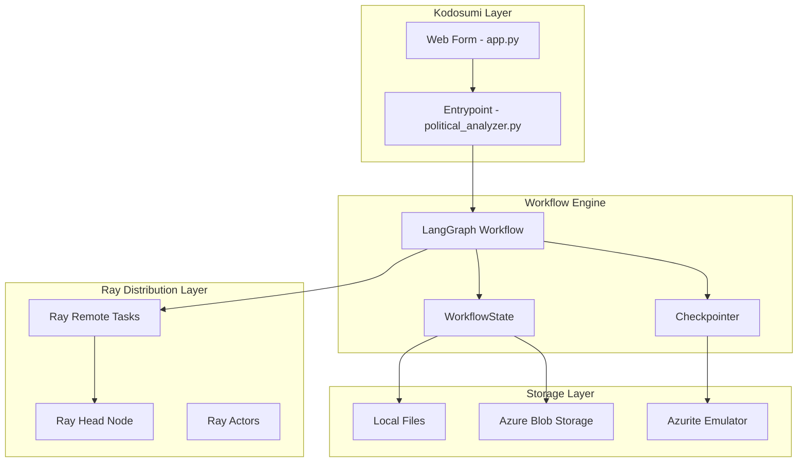
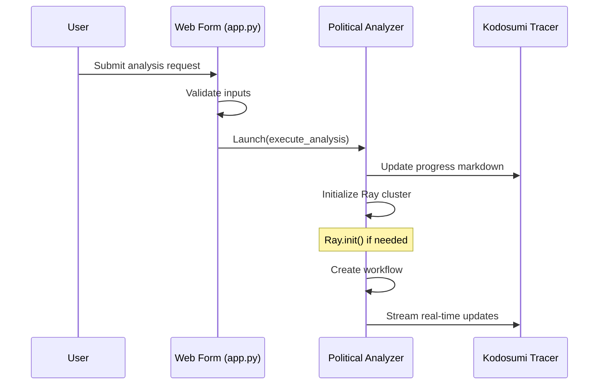
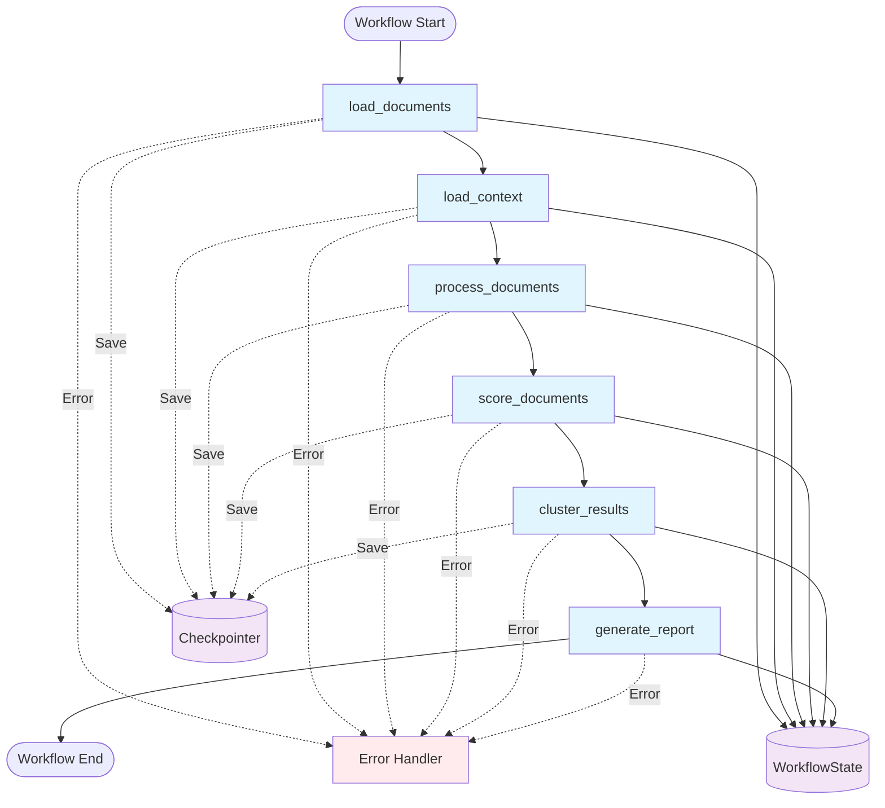
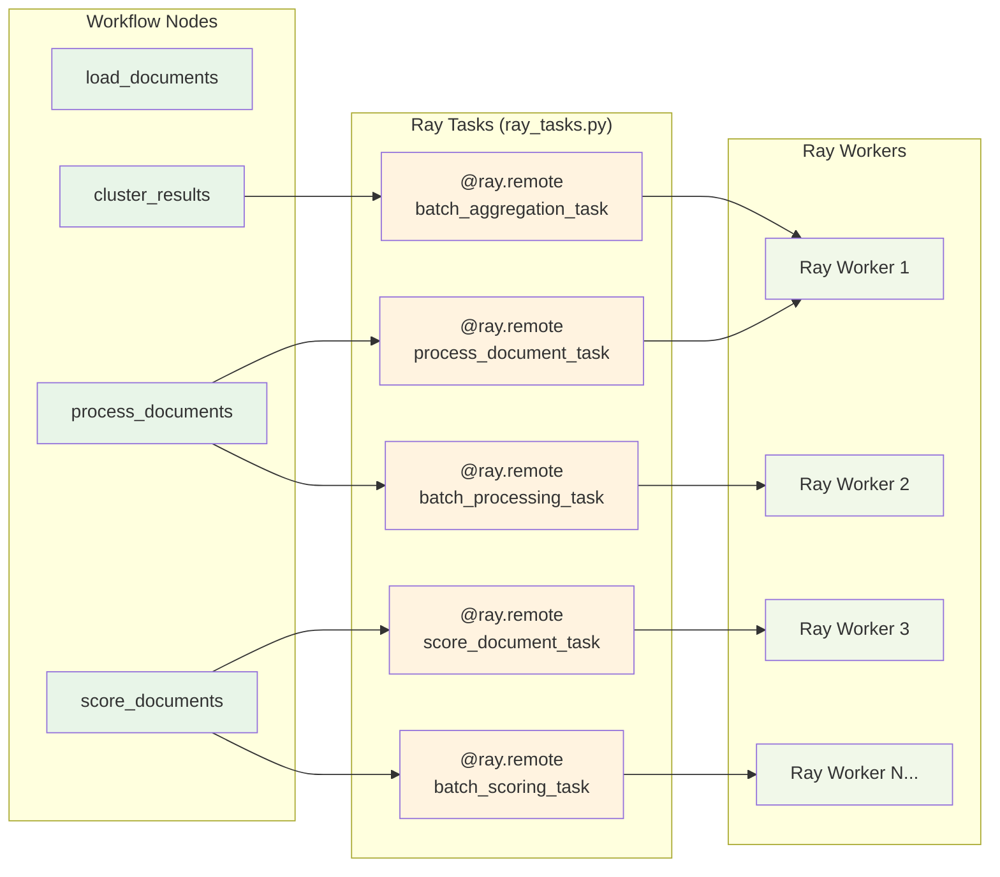
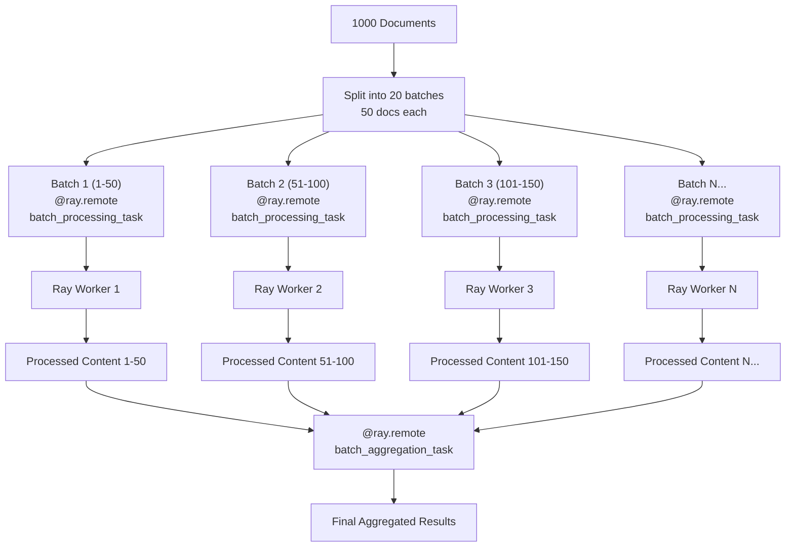
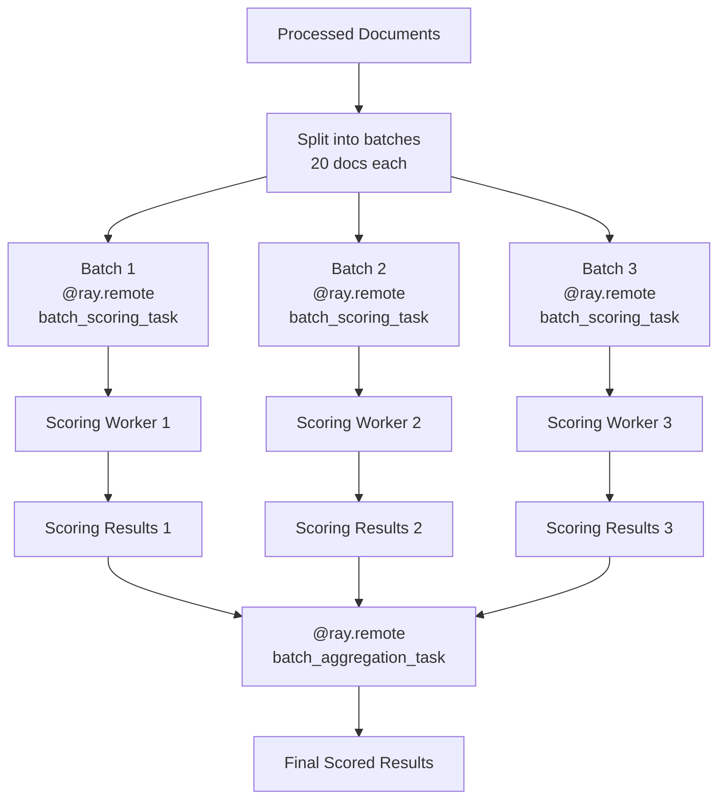
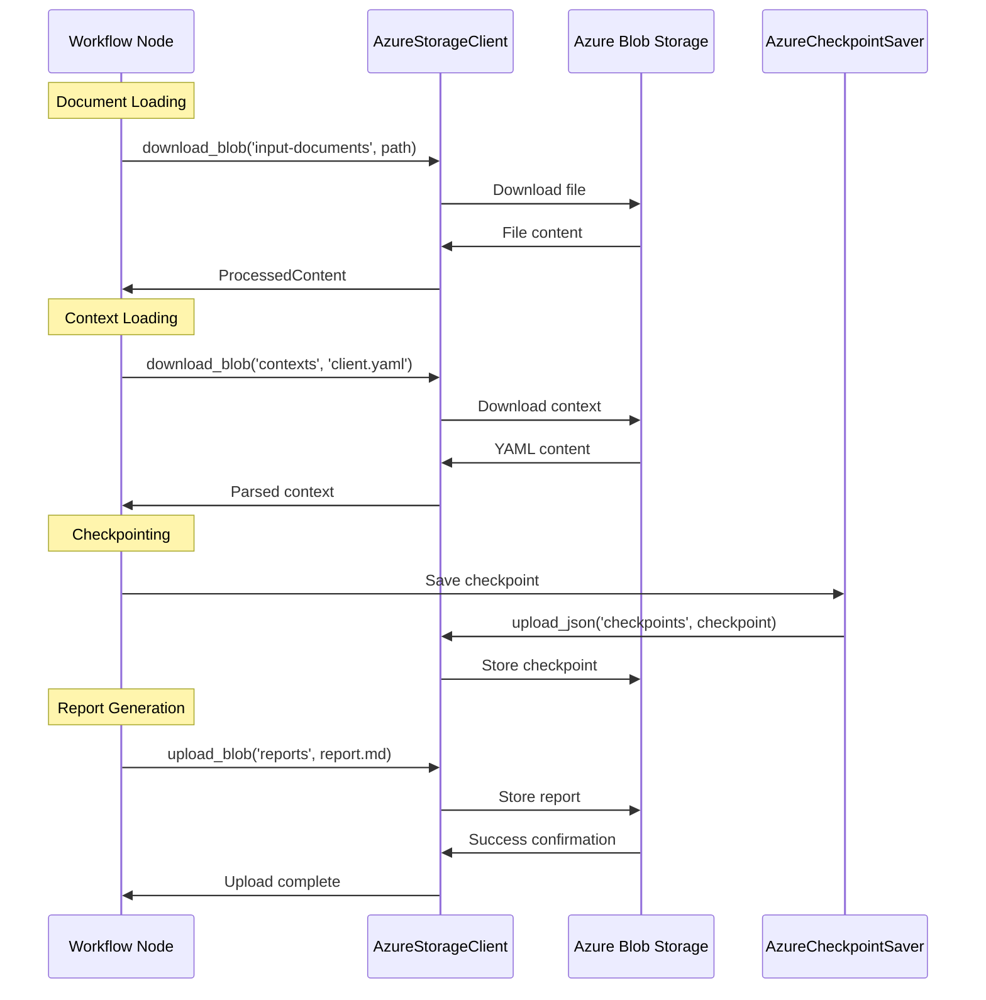
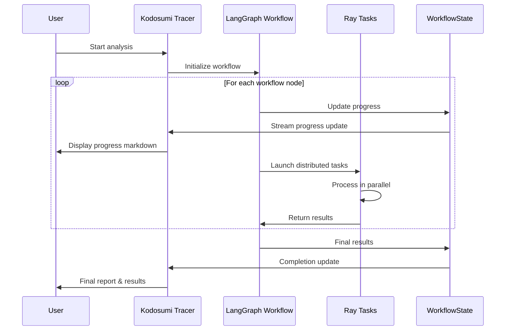
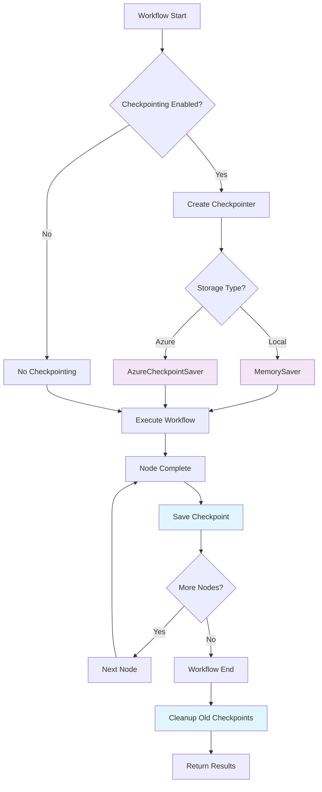

# Political Monitoring Agent - Workflow Graph & Architecture

## Overview

The Political Monitoring Agent uses a **LangGraph-based workflow** with **Ray distributed computing** for scalable document analysis. The system combines state management with distributed processing to handle large document sets efficiently.

## High-Level Architecture



## Detailed Workflow Graph

### 1. Kodosumi Entry Point Flow



### 2. LangGraph Workflow Nodes



## Ray Distributed Computing Integration

### 3. Ray Remote Functions & Actors



### 4. Ray Task Distribution Patterns

#### Document Processing Distribution


#### Scoring Distribution


## Ray Remote Functions Detail

### Core Ray Tasks (src/tasks/ray_tasks.py)

| Function | Decorator | Purpose | Input | Output |
|----------|-----------|---------|-------|---------|
| `process_document_task` | `@ray.remote(max_retries=3)` | Process single document | file_path, doc_id | ProcessedContent |
| `batch_processing_task` | `@ray.remote` | Process document batch | file_paths[], start_index | ProcessedContent[] |
| `score_document_task` | `@ray.remote(max_retries=2)` | Score single document | ProcessedContent, context | ScoringResult |
| `batch_scoring_task` | `@ray.remote` | Score document batch | ProcessedContent[], context | ScoringResult[] |
| `batch_aggregation_task` | `@ray.remote` | Aggregate results | ScoringResult[] | Dict[statistics] |

### Ray Task Execution Flow

```python
# Example: Batch Processing Distribution
@ray.remote
def batch_processing_task(file_paths: List[str], start_index: int) -> List[ProcessedContent]:
    """
    Ray remote function for parallel document processing
    - Runs on Ray worker nodes
    - Handles asyncio.run() for async functions
    - Includes error handling and logging
    - Returns processed content list
    """
    
# Example: Batch Scoring Distribution  
@ray.remote
def batch_scoring_task(documents: List[ProcessedContent], context: Dict[str, Any]) -> List[ScoringResult]:
    """
    Ray remote function for parallel document scoring
    - Distributes scoring across workers
    - Calculates processing time metrics
    - Includes retry logic via max_retries
    - Returns scoring results list
    """
```

## Storage Integration Patterns

### 5. Storage Mode Flow

```mermaid
flowchart TD
    START[Start Workflow] --> STORAGE_CHECK{Storage Mode?}
    
    STORAGE_CHECK -->|Local| LOCAL_PATH[Use ./data/input<br/>./data/context<br/>./data/output]
    STORAGE_CHECK -->|Azure| AZURE_PATH[Use Azure paths<br/>jobs/{job_id}/input<br/>context/client.yaml<br/>jobs/{job_id}/output]
    
    LOCAL_PATH --> LOCAL_OPS[Local File Operations]
    AZURE_PATH --> AZURE_OPS[Azure Blob Operations]
    
    LOCAL_OPS --> WORKFLOW[LangGraph Workflow]
    AZURE_OPS --> WORKFLOW
    
    WORKFLOW --> CHECKPOINT_CHECK{Checkpointing?}
    
    CHECKPOINT_CHECK -->|Local| MEMORY_CHECKPOINT[MemorySaver]
    CHECKPOINT_CHECK -->|Azure| AZURE_CHECKPOINT[AzureCheckpointSaver]
    
    MEMORY_CHECKPOINT --> EXECUTE[Execute Workflow]
    AZURE_CHECKPOINT --> EXECUTE
    
    EXECUTE --> RESULTS[Final Results]
```

### 6. Azure Storage Integration



## Error Handling & Recovery

### 7. Error Flow & Recovery Patterns

```mermaid
flowchart TD
    TASK_START[Ray Task Start] --> TASK_EXEC[Execute Task]
    TASK_EXEC --> SUCCESS{Success?}
    
    SUCCESS -->|Yes| TASK_COMPLETE[Task Complete]
    SUCCESS -->|No| ERROR_CHECK{Max Retries?}
    
    ERROR_CHECK -->|Not Exceeded| RETRY[Retry Task<br/>@ray.remote(max_retries=3)]
    ERROR_CHECK -->|Exceeded| FAIL_HANDLE[Fail Gracefully]
    
    RETRY --> TASK_EXEC
    FAIL_HANDLE --> LOG_ERROR[Log Error]
    LOG_ERROR --> CONTINUE[Continue with Other Tasks]
    
    TASK_COMPLETE --> WORKFLOW_CONTINUE[Continue Workflow]
    CONTINUE --> WORKFLOW_CONTINUE
    
    classDef success fill:#e8f5e8
    classDef error fill:#ffebee
    classDef retry fill:#fff3e0
    
    class TASK_COMPLETE,WORKFLOW_CONTINUE success
    class FAIL_HANDLE,LOG_ERROR error
    class RETRY,ERROR_CHECK retry
```

## Progress Tracking & Real-time Updates

### 8. Progress Streaming Flow



## Checkpointing & Resume Capability

### 9. Checkpoint Flow



## Performance Characteristics

### Ray Distribution Benefits

1. **Parallel Document Processing**: Documents split into batches (default: 50 per batch)
2. **Concurrent Scoring**: Scoring distributed across available workers (default: 20 per batch)
3. **Automatic Retry Logic**: Failed tasks automatically retry (max_retries=3)
4. **Resource Management**: Ray manages worker allocation and load balancing
5. **Fault Tolerance**: Individual task failures don't crash entire workflow

### Scalability Patterns

- **Horizontal Scaling**: Add more Ray workers to increase throughput
- **Batch Size Tuning**: Adjust batch sizes based on document complexity
- **Resource Allocation**: Configure CPU/memory per Ray actor
- **Storage Optimization**: Azure Blob Storage for unlimited document storage

### Monitoring & Observability

- **Ray Dashboard**: Monitor cluster resources and task execution
- **Langfuse Integration**: Track LLM usage and performance
- **Structured Logging**: Comprehensive logging throughout the pipeline
- **Real-time Progress**: Live updates via Kodosumi Tracer
- **Checkpoint Inspection**: View and resume from workflow checkpoints

This architecture provides a robust, scalable foundation for political document analysis with clear separation of concerns, fault tolerance, and comprehensive monitoring capabilities.