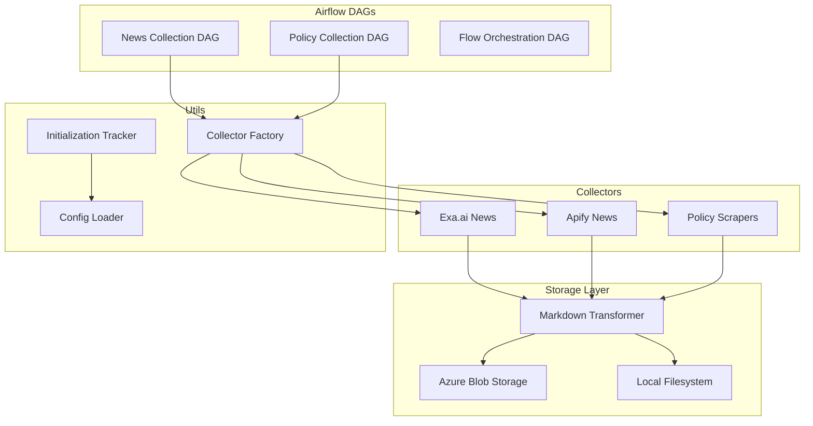

# ETL Pipeline - Automated Data Collection

**Automated political data collection with Apache Airflow, multi-source collectors, and intelligent storage management**

## 🎯 Overview

The ETL pipeline automatically collects, transforms, and stores political documents and news articles from multiple sources. Built on Apache Airflow with pluggable collectors and storage adapters for scalability and reliability.

### **Key Features**
- **🔄 Automated Scheduling**: Daily collection via Airflow DAGs
- **📰 Multi-Source Collection**: News (Exa.ai, Apify) and policy documents
- **🔌 Pluggable Architecture**: Factory pattern for collectors and storage
- **📊 Intelligent Deduplication**: URL and content-based duplicate detection
- **☁️ Cloud Storage**: Azure Blob Storage with local fallback
- **🔄 Retry Logic**: Robust error handling and recovery

## 🏗️ Architecture



## 🚀 Quick Start

### **1. Setup Environment**
```bash
# Configure ETL settings in .env
AIRFLOW_WEBSERVER_PORT=8080
AIRFLOW_USERNAME=admin
AIRFLOW_PASSWORD=admin

# API Keys for collectors
EXA_API_KEY=your_exa_api_key
APIFY_API_KEY=your_apify_api_key

# Storage configuration
USE_AZURE_STORAGE=true
AZURE_STORAGE_CONNECTION_STRING=your_connection_string
```

### **2. Start ETL Services**
```bash
# Start Airflow and dependencies
just services-up

# Verify ETL is running
just etl-status

# Access Airflow UI
open http://localhost:8080  # admin/admin
```

### **3. Trigger Collections**
```bash
# Manual collection (immediate)
just collect-news
just collect-policy

# View collection status
just etl-logs

# Check stored documents
ls data/input/news/
ls data/input/policy/
```

## 📁 Directory Structure

```
src/etl/
├── collectors/           # Data source collectors
│   ├── factory.py       # Collector factory and registration
│   ├── exa_news.py      # Exa.ai news collector
│   ├── exa_direct.py    # Direct Exa.ai HTTP client
│   ├── apify_news.py    # Apify news collector
│   └── policy_landscape.py # Policy document collector
├── dags/                # Airflow DAG definitions
│   ├── news_collection_dag.py     # Daily news collection
│   ├── policy_collection_dag.py   # Daily policy collection
│   └── flow_orchestration_dag.py  # Cross-system orchestration
├── storage/             # Storage abstraction layer
│   ├── base.py          # Abstract storage interface
│   ├── azure.py         # Azure Blob Storage adapter
│   └── local.py         # Local filesystem adapter
├── transformers/        # Data transformation
│   └── markdown_transformer.py    # Content → Markdown
└── utils/               # ETL utilities
    ├── config_loader.py            # Client config management
    ├── initialization_tracker.py   # First-run detection
    └── policy_query_generator.py   # Dynamic query generation
```

## 🔧 Configuration

### **Collector Configuration**
```python
# src/etl/collectors/factory.py
def create_news_collector(collector_type: str, client_config: dict):
    collectors = {
        "exa_news": ExaNewsCollector,
        "exa_direct": ExaDirectCollector,
        "apify_news": ApifyNewsCollector,
    }
    return collectors[collector_type](client_config)
```

### **Storage Configuration**
```python
# Automatic selection based on environment
storage = get_storage()  # Returns Azure or Local based on config

# Manual storage selection
from src.etl.storage import AzureStorage, LocalStorage

azure_storage = AzureStorage()
local_storage = LocalStorage(base_path="data/input")
```

### **DAG Configuration**
```python
# src/etl/dags/news_collection_dag.py
default_args = {
    "owner": "political-monitoring",
    "depends_on_past": False,
    "start_date": days_ago(1),
    "email_on_failure": False,
    "email_on_retry": False,
    "retries": 2,
    "retry_delay": timedelta(minutes=5),
}

# Collection frequency
dag = DAG(
    "news_collection",
    default_args=default_args,
    description="Collect news articles from various sources",
    schedule_interval="0 8 * * *",  # Daily at 8 AM
    catchup=False,
    max_active_runs=1,
)
```

## 🔄 Data Flow

### **1. Collection Process**
```python
# Example: News collection workflow
async def collect_news_workflow():
    # 1. Load client configuration
    config = ClientConfigLoader().load_client_config()
    
    # 2. Create appropriate collector
    collector = create_news_collector("exa_direct", config)
    
    # 3. Collect articles
    articles = await collector.collect_news(
        query=config.company_name,
        max_items=50,
        days_back=1
    )
    
    # 4. Transform to markdown
    transformer = MarkdownTransformer()
    markdown_files = transformer.transform_articles(articles)
    
    # 5. Store with deduplication
    storage = get_storage()
    saved_count = await storage.save_documents(
        markdown_files, 
        container="news"
    )
    
    return saved_count
```

### **2. Storage Patterns**
```python
# File naming convention
# news: YYYYMMDD_source_title-slug.md
# policy: YYYYMMDD_source_title-slug.md

# Metadata preservation
{
    "title": "Article title",
    "url": "source_url",
    "published_date": "2024-01-15T10:30:00Z",
    "source": "Financial Times",
    "collector_type": "exa_direct",
    "collected_date": "2024-01-15T11:00:00Z"
}
```

## 🛠️ Development

### **Adding New Collectors**
```python
# 1. Create collector class
class NewSourceCollector:
    def __init__(self, client_config: dict):
        self.config = client_config
    
    async def collect_news(self, query: str, **kwargs) -> list[dict]:
        # Implement collection logic
        return articles
    
    def get_collector_name(self) -> str:
        return "new_source"

# 2. Register in factory
# src/etl/collectors/__init__.py
from .new_source import NewSourceCollector

COLLECTOR_REGISTRY = {
    "new_source": NewSourceCollector,
    # ... existing collectors
}
```

### **Custom Storage Adapters**
```python
# 1. Inherit from base storage
from src.etl.storage.base import BaseStorage

class CustomStorage(BaseStorage):
    async def save_document(self, content: str, path: str, metadata: dict) -> bool:
        # Implement storage logic
        pass
    
    async def list_documents(self, container: str) -> list[str]:
        # Implement listing logic
        pass

# 2. Register in storage factory
def get_storage() -> BaseStorage:
    if USE_CUSTOM_STORAGE:
        return CustomStorage()
    # ... existing logic
```

### **Testing ETL Components**
```bash
# Unit tests for collectors
python -m pytest tests/unit/test_etl_collectors.py

# Integration tests with real APIs
python -m pytest tests/integration/test_etl_pipeline.py

# Test specific collector
python -c "
from src.etl.collectors.factory import create_news_collector
collector = create_news_collector('exa_direct', {'company_name': 'Test'})
print(collector.get_collector_name())
"
```

## 📊 Monitoring & Operations

### **Collection Metrics**
```bash
# View collection statistics
just etl-status

# Monitor Airflow task performance
open http://localhost:8080/admin/airflow/graph?dag_id=news_collection

# Check storage usage
just storage-stats
```

### **Common Operations**
```bash
# Force restart DAGs
just etl-restart

# Clear failed task instances
airflow tasks clear news_collection 2024-01-15

# Manual backfill
airflow dags backfill news_collection -s 2024-01-01 -e 2024-01-07

# View task logs
airflow tasks logs news_collection collect_news_task 2024-01-15
```

## 🚨 Troubleshooting

### **Common Issues**

#### **Collection Failures**
```bash
# Check API keys
echo $EXA_API_KEY
echo $APIFY_API_KEY

# Verify network connectivity
curl -H "X-API-Key: $EXA_API_KEY" https://api.exa.ai/search

# Check Airflow worker logs
docker logs policiytracker-airflow-worker-1
```

#### **Storage Issues**
```bash
# Verify Azure connection
python -c "
from src.etl.storage.azure import AzureStorage
storage = AzureStorage()
print('Azure connection:', storage.test_connection())
"

# Check local storage permissions
ls -la data/input/
mkdir -p data/input/news data/input/policy
```

#### **Airflow Issues**
```bash
# Reset Airflow database
docker exec policiytracker-airflow-webserver-1 airflow db reset

# Restart Airflow services
docker-compose restart airflow-webserver airflow-scheduler

# Check Airflow configuration
docker exec policiytracker-airflow-webserver-1 airflow config list
```

### **Performance Tuning**
```python
# Adjust collection limits
MAX_ARTICLES_PER_DAG = 100  # Reduce for faster execution
COLLECTOR_TIMEOUT = 30      # Increase for slow sources

# Optimize storage operations
BATCH_SIZE = 10            # Files per batch upload
ENABLE_COMPRESSION = True  # Compress stored content
```

## 🔗 Integration Points

### **With Flows System**
```python
# ETL → Flows integration
# Collected documents automatically trigger processing flows
# via flow_orchestration_dag.py

# Monitor flow triggers
just flow-status
```

### **With Knowledge Graph**
```python
# ETL → GraphRAG integration
# Stored documents are processed into knowledge graph
# via src/flows/data_ingestion/

# Check processing pipeline
just graph-status
```

## 📈 Performance Metrics

### **Target Performance**
- **Collection Speed**: 50+ articles/minute per collector
- **Storage Throughput**: 100+ documents/minute to Azure
- **Error Rate**: <5% for network-related failures
- **Deduplication**: >95% accuracy for URL-based dedup

### **Monitoring Commands**
```bash
# Collection performance
just etl-metrics

# Storage performance  
just storage-metrics

# Error rates
just etl-errors
```

---

**Next Steps**: 
- Configure [Document Flows](../flows/README.md) for processing collected documents
- Set up [Knowledge Graph](../graphrag/README.md) for entity extraction
- Enable [Chat Interface](../chat/README.md) for querying collected intelligence