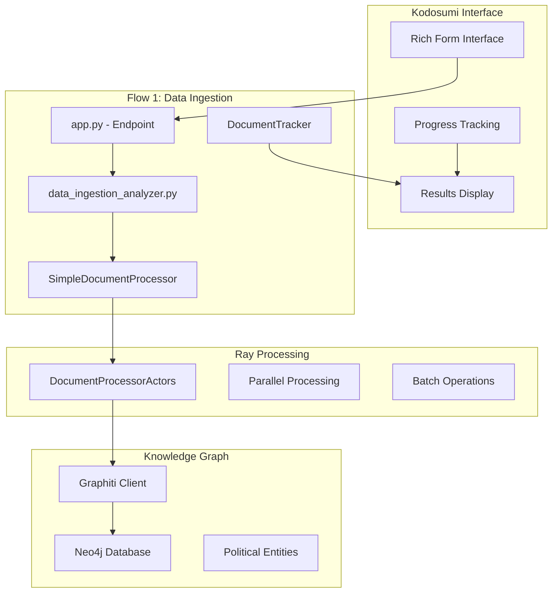

# Document Flows - Processing Pipeline

**Kodosumi-based document processing workflows for transforming raw documents into temporal knowledge graphs**

## 🎯 Overview

The flows system provides a Kodosumi-based interface for processing political documents through multiple stages: ingestion, entity extraction, relationship mapping, and knowledge graph population. Built with Ray for distributed processing and Graphiti for temporal intelligence.

### **Key Features**
- **📄 Flow 1**: Data Ingestion - Document → Knowledge Graph
- **🏢 Flow 2**: Company Context Analysis *(planned)*
- **📊 Flow 3**: Relevance Assessment *(planned)*
- **⚡ Ray Integration**: Distributed processing with parallel actors
- **🧠 GraphRAG**: Advanced entity extraction with custom political schema
- **📈 Progress Tracking**: Real-time processing updates via Kodosumi tracer

## 🏗️ Architecture



## 🚀 Quick Start

### **1. Access Flow Interface**
```bash
# Start the system
just dev

# Access Flow 1: Data Ingestion
open http://localhost:3370
# Login: admin/admin
# Navigate to Data Ingestion Flow
```

### **2. Process Documents**
```yaml
# Flow 1 Configuration
Job Name: "EU AI Act Analysis"
Source Path: data/input/policy/  # Fixed policy directory
Document Limit: 10              # Number of documents to process
Clear Data: false               # Keep existing graph data
```

### **3. Monitor Progress**
- **Real-time updates**: Progress shown in Kodosumi interface
- **Ray dashboard**: http://localhost:8265 for actor monitoring
- **Neo4j browser**: http://localhost:7474 for graph inspection

## 📁 Directory Structure

```
src/flows/
├── data_ingestion/          # Flow 1: Document → Knowledge Graph
│   ├── app.py              # Kodosumi endpoint with rich forms
│   ├── data_ingestion_analyzer.py  # Main entrypoint logic
│   ├── document_processor.py       # Core processing engine
│   ├── document_tracker.py         # Processing state tracking
│   ├── report_generator.py         # Results reporting
│   └── templates/                  # Report templates
│       └── ingestion_report.md.j2
├── shared/                  # Shared components across flows
│   └── graphiti_client.py   # Shared Graphiti client utilities
└── README.md               # This file
```

## 🔧 Flow 1: Data Ingestion

### **Purpose**
Transform political documents into a temporal knowledge graph with entity extraction, relationship mapping, and community detection.

### **Processing Pipeline**
```python
# Core processing flow
async def execute_ingestion(inputs: dict, tracer: Tracer):
    # 1. Document Discovery
    documents = find_documents(source_path, document_limit)
    
    # 2. Ray Actor Initialization
    actors = [DocumentProcessorActor.remote(i) for i in range(3)]
    
    # 3. Parallel Processing
    batches = create_balanced_batches(documents, len(actors))
    results = await asyncio.gather(*[
        actor.process_batch.remote(batch) for actor, batch in zip(actors, batches)
    ])
    
    # 4. Knowledge Graph Population
    # Each actor directly adds episodes to Graphiti
    
    # 5. Results Aggregation
    return comprehensive_report(results)
```

### **Entity Extraction**
```python
# Political entity schema for Graphiti
POLITICAL_ENTITY_TYPES = {
    "Policy": Policy,          # Laws, regulations, directives
    "Company": Company,        # Business entities
    "Politician": Politician,  # Political figures
    "GovernmentAgency": GovernmentAgency,  # Regulatory bodies
    "Regulation": Regulation,  # Implementing rules
    "LobbyGroup": LobbyGroup, # Advocacy organizations
    "LegalFramework": LegalFramework,  # Constitutional provisions
}
```

### **Performance Characteristics**
- **Processing Speed**: 20-40 documents/minute with 3 Ray actors
- **Entity Extraction**: 10-50 entities per document (depending on content)
- **Relationship Mapping**: 5-30 relationships per document
- **Memory Usage**: ~2GB for 100 documents

## 🛠️ Development

### **Creating New Flows**

#### **1. Flow Structure**
```python
# src/flows/new_flow/app.py
from kodosumi.core import ServeAPI, Launch
from kodosumi.core import forms as F

app = ServeAPI()

flow_form = F.Model(
    F.Markdown("# New Flow Description"),
    F.InputText(label="Parameter", name="param"),
    F.Submit("Start Processing")
)

@app.enter(path="/", model=flow_form, version="0.2.0")
async def process_flow(request, inputs):
    return Launch(
        request,
        "src.flows.new_flow.analyzer:execute_flow",
        inputs=inputs
    )
```

#### **2. Flow Analyzer**
```python
# src/flows/new_flow/analyzer.py
from kodosumi import core
from kodosumi.core import Tracer

async def execute_flow(inputs: dict, tracer: Tracer):
    await tracer.markdown("# Starting New Flow")
    
    # Processing logic here
    
    # Return Kodosumi Markdown response
    return core.response.Markdown("# Flow Complete\n\nResults...")
```

#### **3. Ray Configuration**
```python
# config.yaml - Add flow deployment
applications:
  - name: new_flow
    route_prefix: /new-flow
    import_path: src.flows.new_flow.app:fast_app
    runtime_env:
      working_dir: .
```

### **Testing Flows**
```bash
# Unit tests for flow components
python -m pytest tests/unit/test_flows/

# Integration tests with Ray
python -m pytest tests/integration/test_flow_execution.py

# Manual flow testing
python -c "
from src.flows.data_ingestion.document_processor import SimpleDocumentProcessor
from src.flows.data_ingestion.document_tracker import DocumentTracker

processor = SimpleDocumentProcessor(DocumentTracker())
print('Processor initialized successfully')
"
```

### **Custom Document Processors**
```python
# Example: Specialized processor for legal documents
class LegalDocumentProcessor(SimpleDocumentProcessor):
    def __init__(self, tracker: DocumentTracker):
        super().__init__(tracker)
        self.legal_entity_types = {
            "LegalCase": LegalCase,
            "Statute": Statute,
            "Regulation": Regulation,
        }
    
    async def process_document(self, doc_path: Path, graphiti_client):
        # Custom legal document processing
        pass
```

## 📊 Processing Results

### **Report Structure**
```markdown
# Document Ingestion - Final Report

## Execution Summary
- Total Time: 45.2 seconds
- Documents Processed: 10/10
- Success Rate: 100%
- Entities Extracted: 127
- Relationships Created: 89

## Knowledge Graph Growth
- Policy Entities: 15
- Company Entities: 8
- Government Agencies: 5
- Politicians: 3

## Processing Performance
- Average Processing Time: 4.5s per document
- Ray Speedup: 3.2x over sequential
- Entity Extraction Rate: 12.7 entities/document
```

### **Accessing Results**
```python
# Via Neo4j Browser (http://localhost:7474)
MATCH (n) 
WHERE NOT n:Community AND NOT n:Episode
RETURN labels(n)[0] as Type, count(n) as Count
ORDER BY Count DESC

# Via Python client
from src.flows.shared.graphiti_client import SharedGraphitiClient

async with SharedGraphitiClient() as client:
    stats = await client.get_graph_stats()
    print(f"Total entities: {stats['total_entities']}")
```

## 🔄 Integration Points

### **With ETL Pipeline**
```python
# ETL collected documents → Flow processing
# Automatic trigger via flow_orchestration_dag.py

source_documents = "data/input/policy/"  # From ETL
processed_documents = await flow_processor.process_directory(source_documents)
```

### **With Chat Interface**
```python
# Processed knowledge graph → Chat queries
# Chat interface automatically accesses populated graph

chat_query = "What policies affect AI companies?"
response = await chat_interface.query(chat_query)  # Uses flow-processed data
```

### **With Scoring System**
```python
# Flow results → Intelligence scoring
# Future integration for relevance assessment

scores = await scoring_engine.assess_relevance(processed_entities)
```

## 🚨 Troubleshooting

### **Common Issues**

#### **Ray Actor Failures**
```bash
# Check Ray dashboard
open http://localhost:8265

# View actor logs
just ray-logs

# Restart Ray cluster
ray stop && ray start --head
```

#### **Graphiti Connection Issues**
```bash
# Verify Neo4j is running
docker ps | grep neo4j

# Test Graphiti connection
python -c "
from graphiti_core import Graphiti
import asyncio

async def test():
    client = Graphiti('bolt://localhost:7687', 'neo4j', 'password123')
    await client.build_indices_and_constraints()
    print('Connection successful')

asyncio.run(test())
"
```

#### **Document Processing Errors**
```bash
# Check document encoding
file data/input/policy/*.md

# Verify document content
head -20 data/input/policy/problematic_file.md

# Test single document processing
python scripts/_dev_testing/process_documents_no_clear.py
```

### **Performance Issues**
```python
# Adjust Ray actor configuration
NUM_ACTORS = 2          # Reduce for memory constraints
BATCH_SIZE = 5          # Smaller batches for stability
ACTOR_MEMORY = "2GB"    # Increase for large documents

# Optimize Graphiti operations
ENABLE_BATCH_PROCESSING = True
CHUNK_SIZE = 1000       # Optimize for document size
```

## 📈 Monitoring & Metrics

### **Real-time Monitoring**
```bash
# Flow processing status
just flow-status

# Ray cluster utilization
just ray-status

# Knowledge graph growth
just graph-metrics
```

### **Performance Metrics**
```python
# Processing statistics
{
    "documents_per_minute": 25.5,
    "entities_per_document": 12.7,
    "relationships_per_document": 8.9,
    "success_rate": 0.95,
    "average_processing_time": 4.2,
    "ray_speedup": 3.1
}
```

## 🔮 Future Flows

### **Flow 2: Company Context Analysis**
- **Purpose**: Analyze company-specific impact of processed policies
- **Input**: Knowledge graph + company profile
- **Output**: Contextual relevance scoring and impact assessment

### **Flow 3: Relevance Assessment**
- **Purpose**: Multi-dimensional relevance scoring for business intelligence
- **Input**: Processed entities + client context
- **Output**: Prioritized intelligence reports with confidence scores

### **Flow 4: Temporal Analysis**
- **Purpose**: Track policy evolution and predict future developments
- **Input**: Historical knowledge graph data
- **Output**: Trend analysis and predictive insights

---

**Next Steps**:
- Configure [ETL Pipeline](../etl/README.md) to provide source documents
- Set up [Knowledge Graph](../graphrag/README.md) for entity management
- Enable [Chat Interface](../chat/README.md) for querying processed data