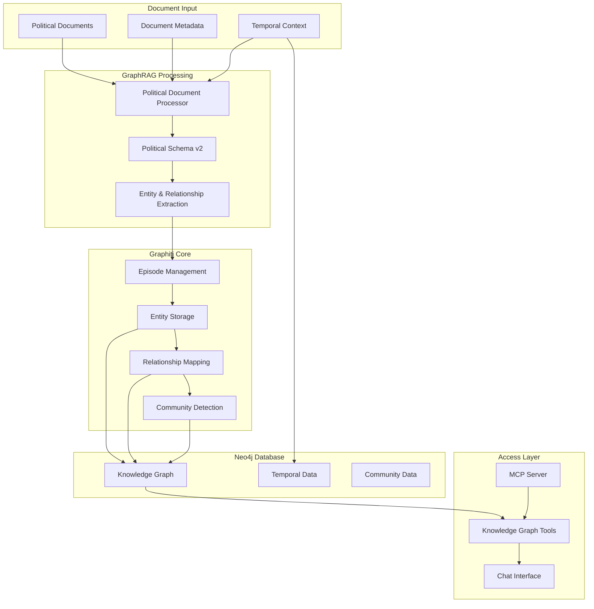

# GraphRAG & Knowledge Graph System

**Temporal knowledge graph construction with Graphiti integration for political intelligence analysis**

## 🎯 Overview

The GraphRAG system transforms political documents into a temporal knowledge graph using Graphiti's advanced entity extraction and relationship mapping. Designed specifically for political monitoring with custom schemas, temporal tracking, and community detection.

### **Key Features**
- **🧠 Graphiti Integration**: Direct API usage with custom political entity types
- **⏰ Temporal Intelligence**: Track entity evolution and relationship changes over time
- **🏘️ Community Detection**: Automatic clustering of related political entities
- **📊 Custom Schema**: 7 specialized entity types for political domain
- **🔗 MCP Integration**: Model Context Protocol support for Claude Code interaction
- **🔄 Episode Management**: Document chunking and embedding with temporal context

## 🏗️ Architecture



## 🚀 Quick Start

### **1. Initialize Knowledge Graph**
```bash
# Start Neo4j and services
just services-up

# Initialize Graphiti schema
python -c "
import asyncio
from graphiti_core import Graphiti

async def init():
    client = Graphiti('bolt://localhost:7687', 'neo4j', 'password123')
    await client.build_indices_and_constraints()
    print('Graphiti initialized successfully')

asyncio.run(init())
"
```

### **2. Process Documents**
```python
from pathlib import Path
from src.graphrag.political_document_processor import PoliticalDocumentProcessor
from src.graphrag.graphiti_config import GraphitiConfig

# Initialize processor
config = GraphitiConfig()
processor = PoliticalDocumentProcessor(
    llm_client=None,  # Uses internal client
    graphiti_config=config
)

# Process a document
result = await processor.process_document(Path("data/input/policy/example.md"))
print(f"Extracted {result.entities_extracted} entities")
```

### **3. Query Knowledge Graph**
```bash
# Via Neo4j Browser
open http://localhost:7474

# Via MCP tools (when available)
# Chat interface automatically uses these tools

# Via direct Graphiti client
python scripts/_dev_testing/explore_graphiti_mcp_search.py
```

## 📁 Directory Structure

```
src/graphrag/
├── __init__.py
├── document_pipeline.py         # Legacy Neo4j GraphRAG (deprecated)
├── graphiti_config.py          # Graphiti configuration management
├── knowledge_builder.py        # Legacy knowledge building (deprecated)
├── mcp_graphiti_client.py      # MCP integration client
├── political_document_processor.py  # Core document processor
├── political_schema.py         # Legacy schema (deprecated)
└── political_schema_v2.py      # Current political entity schema
```

## 🔧 Configuration

### **Graphiti Configuration**
```python
# src/graphrag/graphiti_config.py
class GraphitiConfig:
    def __init__(self):
        self.neo4j_uri = "bolt://localhost:7687"
        self.neo4j_user = "neo4j"
        self.neo4j_password = "password123"
        self.group_id = "political_monitoring_v2"
        self.openai_api_key = os.getenv("OPENAI_API_KEY")
        
    def validate(self):
        # Validates all required settings
        pass
```

### **Political Schema v2**
```python
# Custom entity types for political domain
class Policy(BaseModel):
    """High-level laws, acts, directives, and policy frameworks"""
    policy_name: str = Field(..., description="The name of the policy")
    jurisdiction: str | None = Field(None, description="Primary jurisdiction")
    status: str | None = Field(None, description="Current status")
    effective_date: str | None = Field(None, description="Effective date")

class Company(BaseModel):
    """Business entities affected by regulations"""
    company_name: str = Field(..., description="The company name")
    sector: str | None = Field(None, description="Industry sector")
    jurisdiction: str | None = Field(None, description="Operations jurisdiction")

class Politician(BaseModel):
    """Political figures and government representatives"""
    politician_name: str = Field(..., description="The politician's name")
    position: str | None = Field(None, description="Political position")
    party: str | None = Field(None, description="Political party")

# Additional types: GovernmentAgency, Regulation, LobbyGroup, LegalFramework
```

### **Episode Creation Strategy**
```python
# Document → Episode transformation
async def create_episode_content(content: str, metadata: DocumentMetadata):
    """Transform document into Graphiti episode with temporal context."""
    
    episode_content = f"""POLITICAL DOCUMENT: {metadata.source}
Date: {metadata.modified_at.strftime('%Y-%m-%d')}
Type: Political/Regulatory Document

{content}"""
    
    return episode_content
```

## 🛠️ Core Components

### **1. Political Document Processor**
```python
# Main processing class
class PoliticalDocumentProcessor:
    async def process_document(self, document_path: Path) -> ProcessingResult:
        # 1. Extract document content and metadata
        content, metadata = await self._extract_document_content(document_path)
        
        # 2. Create episode content with temporal context
        episode_content = await self._create_episode_content(content, metadata)
        
        # 3. Process through Graphiti with custom entity types
        result = await self._create_graphiti_episode(episode_content, metadata)
        
        return ProcessingResult(
            document_path=str(document_path),
            episode_id=result.episode.uuid,
            entities_extracted=len(result.nodes),
            relationships_extracted=len(result.edges),
            success=True
        )
```

### **2. Graphiti Client Integration**
```python
# Direct Graphiti API usage
async def _create_graphiti_episode(self, content: str, metadata: DocumentMetadata):
    entity_types = {
        "Policy": Policy,
        "Company": Company,
        "Politician": Politician,
        "GovernmentAgency": GovernmentAgency,
        "Regulation": Regulation,
        "LobbyGroup": LobbyGroup,
        "LegalFramework": LegalFramework,
    }
    
    result = await self.graphiti_client.add_episode(
        name=episode_name,
        episode_body=content,
        source_description=f"Political document: {metadata.source}",
        reference_time=reference_time,
        source=EpisodeType.text,
        group_id=self.graphiti_config.group_id,
        entity_types=entity_types,  # Custom political schema
    )
    
    return result
```

### **3. MCP Integration**
```python
# Model Context Protocol for Claude Code integration
class GraphitiMCPClient:
    async def search_nodes(self, query: str, limit: int = 10):
        """Search for nodes via MCP protocol."""
        # Implementation for Claude Code integration
        pass
    
    async def get_entity_details(self, entity_id: str):
        """Get detailed entity information."""
        pass
    
    async def find_relationships(self, entity_id: str):
        """Find entity relationships."""
        pass
```

## 📊 Knowledge Graph Schema

### **Entity Distribution (Typical)**
```
Policy: 25-40%           # Laws, regulations, directives
Company: 20-30%          # Business entities
GovernmentAgency: 15-25% # Regulatory bodies
Politician: 10-20%       # Political figures
Regulation: 5-15%        # Implementing rules
LobbyGroup: 3-10%        # Advocacy organizations
LegalFramework: 2-8%     # Constitutional provisions
```

### **Relationship Patterns**
```cypher
-- Common relationship patterns in political domain

-- Policy impacts
(Policy)-[:AFFECTS]->(Company)
(Policy)-[:REQUIRES_COMPLIANCE]->(Company)

-- Regulatory hierarchy
(Policy)-[:IMPLEMENTED_BY]->(Regulation)
(GovernmentAgency)-[:ENFORCES]->(Regulation)

-- Political influence
(Politician)-[:PROPOSED]->(Policy)
(LobbyGroup)-[:ADVOCATES_FOR]->(Policy)

-- Jurisdictional scope
(Policy)-[:APPLIES_IN]->(Jurisdiction)
(Company)-[:OPERATES_IN]->(Jurisdiction)
```

## 🔄 Processing Workflows

### **Batch Document Processing**
```python
async def process_documents_batch(document_paths: list[Path], batch_size: int = 3):
    """Process multiple documents in batches."""
    results = []
    
    for i in range(0, len(document_paths), batch_size):
        batch = document_paths[i:i + batch_size]
        
        # Process batch concurrently
        batch_results = await asyncio.gather(*[
            self.process_document(doc_path) for doc_path in batch
        ])
        
        results.extend(batch_results)
        
        # Brief pause between batches to avoid overwhelming LLM API
        await asyncio.sleep(1)
    
    return results
```

### **Community Detection**
```python
async def build_communities():
    """Build communities of related political entities."""
    try:
        communities = await self.graphiti_client.build_communities()
        
        # Community structure example:
        # Community 1: "EU AI Regulation" - Policy, Companies, Regulators
        # Community 2: "US Privacy Laws" - Policies, Tech Companies, Advocates
        
        return communities
    except Exception as e:
        logger.error(f"Community detection failed: {e}")
        return []
```

## 🔍 Querying & Analysis

### **Entity Search**
```python
# Search for specific entities
async def search_entities(query: str, entity_type: str = None):
    results = await graphiti_client.search(query)
    
    if entity_type:
        # Filter by entity type
        filtered = [node for node in results.nodes 
                   if entity_type in node.labels]
        return filtered
    
    return results.nodes
```

### **Temporal Analysis**
```python
# Track entity evolution over time
async def get_entity_timeline(entity_name: str):
    """Get timeline of entity mentions and changes."""
    
    # Query episodes containing the entity
    results = await graphiti_client.search(f"{entity_name} timeline")
    
    # Sort by temporal reference
    timeline = sorted(results.episodes, key=lambda e: e.reference_time)
    
    return timeline
```

### **Relationship Traversal**
```python
# Multi-hop relationship discovery
async def find_entity_connections(entity_id: str, max_hops: int = 3):
    """Find connections between entities up to max_hops."""
    
    connections = []
    visited = set()
    
    async def traverse(current_id, hops_remaining):
        if hops_remaining == 0 or current_id in visited:
            return
        
        visited.add(current_id)
        relationships = await get_entity_relationships(current_id)
        
        for rel in relationships:
            connections.append(rel)
            if hops_remaining > 1:
                await traverse(rel.target_id, hops_remaining - 1)
    
    await traverse(entity_id, max_hops)
    return connections
```

## 🚨 Troubleshooting

### **Common Issues**

#### **Graphiti Connection Problems**
```bash
# Verify Neo4j is running
docker ps | grep neo4j

# Test connection
python -c "
from graphiti_core import Graphiti
import asyncio

async def test():
    client = Graphiti('bolt://localhost:7687', 'neo4j', 'password123')
    await client.build_indices_and_constraints()
    print('✅ Graphiti connection successful')

asyncio.run(test())
"
```

#### **Entity Extraction Issues**
```bash
# Check OpenAI API key
echo $OPENAI_API_KEY

# Test LLM connectivity
python -c "
from openai import OpenAI
client = OpenAI()
response = client.chat.completions.create(
    model='gpt-4o-mini',
    messages=[{'role': 'user', 'content': 'Hello'}]
)
print('✅ OpenAI connection successful')
"
```

#### **Schema Validation Errors**
```python
# Validate custom entity schema
from src.graphrag.political_schema_v2 import Policy, Company

try:
    policy = Policy(policy_name="Test Policy", jurisdiction="EU")
    company = Company(company_name="Test Corp", sector="technology")
    print("✅ Schema validation successful")
except Exception as e:
    print(f"❌ Schema error: {e}")
```

### **Performance Optimization**
```python
# Optimize processing for large document sets
BATCH_SIZE = 3              # Documents processed concurrently
MAX_RETRIES = 3             # LLM API retry attempts
CHUNK_SIZE = 1000           # Characters per document chunk
ENABLE_CACHING = True       # Cache entity extraction results
```

## 📈 Performance Metrics

### **Target Performance**
- **Entity Extraction**: 10-50 entities per document
- **Relationship Detection**: 5-30 relationships per document
- **Processing Speed**: 1-5 documents per minute (LLM-limited)
- **Accuracy**: >90% for entity recognition, >85% for relationships

### **Monitoring Commands**
```bash
# Graph statistics
python -c "
import asyncio
from src.flows.shared.graphiti_client import SharedGraphitiClient

async def stats():
    async with SharedGraphitiClient() as client:
        stats = await client.get_graph_stats()
        print(f'Entities: {stats[\"total_entities\"]}')
        print(f'Relationships: {stats[\"total_relationships\"]}')

asyncio.run(stats())
"

# Community analysis
just build-communities

# Entity distribution
just graph-metrics
```

## 🔗 Integration Points

### **With Document Flows**
```python
# Flows → GraphRAG processing
from src.flows.data_ingestion.document_processor import SimpleDocumentProcessor

# Document processor automatically uses GraphRAG system
processor = SimpleDocumentProcessor(tracker, clear_mode=False)
results = await processor.process_documents(source_path, document_limit)
```

### **With Chat Interface**
```python
# GraphRAG → Chat tools
from src.chat.tools.entity import EntityTool
from src.chat.tools.search import SearchTool

# Chat interface automatically uses knowledge graph tools
entity_tool = EntityTool(graphiti_client)
search_tool = SearchTool(graphiti_client)
```

### **With MCP Servers**
```python
# GraphRAG → MCP → Claude Code
# MCP servers provide Claude Code access to knowledge graph

# Available via Docker services:
# - graphiti-mcp (port 8765)
# - neo4j-memory-mcp (port 8766)
```

## 🔮 Future Enhancements

### **Advanced Entity Resolution**
- Cross-document entity merging and deduplication
- Confidence scoring for entity extraction
- Entity canonical name resolution

### **Enhanced Temporal Intelligence**
- Entity state change tracking
- Temporal relationship evolution
- Predictive relationship modeling

### **Custom Retrievers**
- Domain-specific search optimization
- Multi-modal retrieval (text + metadata)
- Semantic similarity clustering

---

**Next Steps**:
- Configure [Document Flows](../flows/README.md) for automatic processing
- Set up [Chat Interface](../chat/README.md) for interactive querying
- Enable [ETL Pipeline](../etl/README.md) for continuous data ingestion