```mermaid
graph TB
    subgraph "Core Models"
        CONTENT[Content Models]
        JOB[Job Models]
        SCORING[Scoring Models]
        REPORT[Report Models]
    end
    
    subgraph "Content Models"
        DOC_META[DocumentMetadata]
        PROC_CONTENT[ProcessedContent]
        CONTENT_BATCH[ContentBatch]
        DOC_TYPE[DocumentType Enum]
    end
    
    subgraph "Job Models"
        JOB_REQ[JobRequest]
        JOB_OBJ[Job]
        JOB_STATUS[JobStatus Enum]
    end
    
    subgraph "Scoring Models"
        SCORE_RESULT[ScoringResult]
        CONFIDENCE[ConfidenceLevel]
        PRIORITY[PriorityLevel]
        DIMENSIONS[ScoringDimensions]
    end
    
    subgraph "Report Models"
        TOPIC_CLUSTER[TopicCluster]
        PRIORITY_QUEUE[PriorityQueue]
        REPORT_SUMMARY[ReportSummary]
    end
    
    CONTENT --> DOC_META
    CONTENT --> PROC_CONTENT
    JOB --> JOB_REQ
    JOB --> JOB_STATUS
    SCORING --> SCORE_RESULT
    SCORING --> CONFIDENCE
    REPORT --> TOPIC_CLUSTER
    REPORT --> PRIORITY_QUEUE
```

# Data Models & Schemas

**Pydantic-based data models for type safety, validation, and API consistency across the Political Monitoring Agent**

## 🎯 Overview

The models system provides comprehensive data validation, serialization, and type safety for all components of the Political Monitoring Agent. Built on Pydantic v2 with custom validators and computed fields for domain-specific requirements.

### **Key Features**
- **🔒 Type Safety**: Strict typing with runtime validation
- **📊 Domain Models**: Political monitoring specific schemas
- **🔄 Serialization**: JSON/dict conversion with proper formatting
- **✅ Validation**: Custom validators for political domain data
- **📈 Computed Fields**: Automatic field calculation and derivation
- **🏗️ Composability**: Models compose cleanly for complex data structures

## 🏗️ Model Categories



## 📁 Directory Structure

```
src/models/
├── __init__.py              # Public model exports
├── content.py               # Document and content models
├── job.py                   # Workflow and execution models
├── report.py                # Analysis result models
└── scoring.py               # Relevance and priority models
```

## 🔧 Core Models

### **1. Content Models** (`content.py`)

#### **DocumentMetadata**
```python
class DocumentMetadata(BaseModel):
    """Comprehensive document metadata with validation."""
    
    source: str = Field(..., description="Original document source path")
    type: DocumentType = Field(..., description="Document type")
    file_path: str = Field(..., description="Full file path")
    file_size_bytes: int = Field(..., ge=0, description="File size in bytes")
    created_at: Optional[datetime] = None
    modified_at: Optional[datetime] = None
    author: Optional[str] = None
    tags: list[str] = Field(default_factory=list)
    extraction_metadata: dict[str, Any] = Field(default_factory=dict)

    model_config = ConfigDict(use_enum_values=True)

# Usage example
metadata = DocumentMetadata(
    source="data/input/policy/eu_ai_act.md",
    type=DocumentType.MARKDOWN,
    file_path="/full/path/to/eu_ai_act.md",
    file_size_bytes=15420,
    tags=["AI", "regulation", "EU"]
)
```

#### **ProcessedContent**
```python
class ProcessedContent(BaseModel):
    """Document content after processing with validation."""
    
    id: str = Field(..., pattern=r"^doc_[A-Za-z0-9_]+$")
    raw_text: str = Field(..., min_length=1)
    metadata: DocumentMetadata
    processing_timestamp: datetime
    language: str = Field(default="en")
    sections: list[dict[str, str]] = Field(default_factory=list)
    extraction_errors: list[str] = Field(default_factory=list)

    @computed_field
    @property
    def word_count(self) -> int:
        """Calculate word count from raw text."""
        return len(self.raw_text.split()) if self.raw_text else 0

    @field_validator("raw_text", mode="before")
    @classmethod
    def strip_text(cls, v: str) -> str:
        return v.strip() if v else ""
```

### **2. Job Models** (`job.py`)

#### **JobRequest**
```python
class JobRequest(BaseModel):
    """Analysis job configuration and parameters."""
    
    job_name: str = Field(..., min_length=3, max_length=100)
    input_folder: str = Field(..., description="Source document folder")
    context_file: str = Field(..., description="Client context file path")
    priority_threshold: float = Field(default=70.0, ge=0, le=100)
    include_low_confidence: bool = Field(default=False)
    clustering_enabled: bool = Field(default=True)
    max_documents: Optional[int] = Field(default=None, ge=1)

    @field_validator("job_name")
    @classmethod
    def validate_job_name(cls, v: str) -> str:
        # Remove invalid characters for job names
        cleaned = re.sub(r'[^\w\s-]', '', v)
        return cleaned.strip()
```

#### **Job**
```python
class Job(BaseModel):
    """Complete job execution context with lifecycle tracking."""
    
    id: str = Field(..., pattern=r"^job_\d{8}_\d{6}_[A-Za-z0-9]{6}$")
    request: JobRequest
    status: JobStatus = JobStatus.PENDING
    created_at: datetime
    started_at: Optional[datetime] = None
    completed_at: Optional[datetime] = None
    execution_metadata: dict[str, Any] = Field(default_factory=dict)
    error_message: Optional[str] = None

    @computed_field
    @property
    def duration_seconds(self) -> Optional[float]:
        """Calculate job execution duration."""
        if self.started_at and self.completed_at:
            return (self.completed_at - self.started_at).total_seconds()
        return None

    @computed_field
    @property
    def is_finished(self) -> bool:
        """Check if job has completed (successfully or failed)."""
        return self.status in [JobStatus.COMPLETED, JobStatus.FAILED]
```

### **3. Scoring Models** (`scoring.py`)

#### **ScoringResult**
```python
class ScoringResult(BaseModel):
    """Comprehensive scoring result with confidence and justification."""
    
    document_id: str
    overall_score: float = Field(..., ge=0, le=100)
    priority_level: PriorityLevel
    confidence_level: ConfidenceLevel
    
    # Dimensional scores
    keyword_score: float = Field(..., ge=0, le=100)
    semantic_score: float = Field(..., ge=0, le=100)
    temporal_score: float = Field(..., ge=0, le=100)
    source_score: float = Field(..., ge=0, le=100)
    impact_score: float = Field(..., ge=0, le=100)
    
    # Analysis metadata
    justification: str = Field(..., min_length=10)
    key_topics: list[str] = Field(default_factory=list)
    relevant_entities: list[str] = Field(default_factory=list)
    scoring_timestamp: datetime = Field(default_factory=datetime.now)

    @computed_field
    @property
    def dimensional_scores(self) -> dict[str, float]:
        """Get all dimensional scores as a dictionary."""
        return {
            "keyword": self.keyword_score,
            "semantic": self.semantic_score,
            "temporal": self.temporal_score,
            "source": self.source_score,
            "impact": self.impact_score
        }

    @field_validator("overall_score", mode="after")
    @classmethod
    def validate_score_consistency(cls, v: float, info) -> float:
        """Ensure overall score is consistent with dimensional scores."""
        # Could add logic to validate score calculation
        return v
```

### **4. Report Models** (`report.py`)

#### **TopicCluster**
```python
class TopicCluster(BaseModel):
    """Group of documents with shared topics or themes."""
    
    topic_name: str
    topic_description: str
    document_count: int = Field(..., ge=0)
    average_score: float = Field(..., ge=0, le=100)
    documents: list[ScoringResult]
    key_themes: list[str] = Field(default_factory=list)
    representative_entities: list[str] = Field(default_factory=list)

    @computed_field
    @property
    def priority_distribution(self) -> dict[str, int]:
        """Count documents by priority level."""
        distribution = {}
        for doc in self.documents:
            priority = doc.priority_level.value
            distribution[priority] = distribution.get(priority, 0) + 1
        return distribution

    @field_validator("documents", mode="after")
    @classmethod
    def validate_document_count(cls, v: list, info) -> list:
        """Ensure document_count matches actual documents."""
        if info.data and "document_count" in info.data:
            expected_count = info.data["document_count"]
            if len(v) != expected_count:
                raise ValueError(f"Document count mismatch: expected {expected_count}, got {len(v)}")
        return v
```

## 🔧 Usage Patterns

### **Model Creation and Validation**
```python
# Creating models with validation
try:
    job_request = JobRequest(
        job_name="EU Policy Analysis",
        input_folder="data/input/policy",
        context_file="data/context/client.yaml",
        priority_threshold=75.0
    )
    print("✅ Job request valid")
except ValidationError as e:
    print(f"❌ Validation error: {e}")

# Accessing computed fields
content = ProcessedContent(
    id="doc_eu_ai_act_2024",
    raw_text="The European AI Act establishes...",
    metadata=metadata,
    processing_timestamp=datetime.now()
)
print(f"Word count: {content.word_count}")  # Automatically computed
```

### **Serialization and Deserialization**
```python
# Model to dict/JSON
job_dict = job.model_dump()
job_json = job.model_dump_json()

# Dict/JSON to model
job_from_dict = Job.model_validate(job_dict)
job_from_json = Job.model_validate_json(job_json)

# Partial updates
updated_job = job.model_copy(update={"status": JobStatus.RUNNING})
```

### **Custom Validation**
```python
# Custom field validators
class CustomDocumentMetadata(DocumentMetadata):
    @field_validator("file_size_bytes")
    @classmethod
    def validate_reasonable_size(cls, v: int) -> int:
        """Ensure file size is reasonable (< 100MB)."""
        max_size = 100 * 1024 * 1024  # 100MB
        if v > max_size:
            raise ValueError(f"File too large: {v} bytes (max: {max_size})")
        return v

    @field_validator("tags")
    @classmethod
    def normalize_tags(cls, v: list[str]) -> list[str]:
        """Normalize tags to lowercase."""
        return [tag.lower().strip() for tag in v if tag.strip()]
```

## 🔍 Model Relationships

### **Composition Patterns**
```python
# Models compose naturally
class AnalysisResult(BaseModel):
    """Complete analysis result combining multiple models."""
    
    job: Job
    processed_documents: list[ProcessedContent]
    scoring_results: list[ScoringResult]
    topic_clusters: list[TopicCluster]
    execution_summary: dict[str, Any]

    @computed_field
    @property
    def success_rate(self) -> float:
        """Calculate processing success rate."""
        total = len(self.processed_documents)
        successful = len([doc for doc in self.processed_documents 
                         if not doc.extraction_errors])
        return (successful / total * 100) if total > 0 else 0
```

### **Model Inheritance**
```python
# Base model for common patterns
class TimestampedModel(BaseModel):
    """Base model with automatic timestamping."""
    
    created_at: datetime = Field(default_factory=datetime.now)
    updated_at: Optional[datetime] = None

    def mark_updated(self):
        """Mark model as updated."""
        self.updated_at = datetime.now()

# Inherit from base
class TrackedJob(TimestampedModel):
    """Job with automatic timestamp tracking."""
    
    id: str
    name: str
    status: JobStatus = JobStatus.PENDING
```

## 🛠️ Development Patterns

### **Adding New Models**
```python
# 1. Define the model with proper typing
class NewModel(BaseModel):
    """Clear docstring describing the model purpose."""
    
    # Required fields
    id: str = Field(..., description="Unique identifier")
    name: str = Field(..., min_length=1, max_length=100)
    
    # Optional fields with defaults
    created_at: datetime = Field(default_factory=datetime.now)
    metadata: dict[str, Any] = Field(default_factory=dict)
    
    # Computed fields
    @computed_field
    @property
    def computed_value(self) -> str:
        """Compute value based on other fields."""
        return f"{self.name}_{self.id}"
    
    # Validators
    @field_validator("name")
    @classmethod
    def validate_name(cls, v: str) -> str:
        """Custom validation for name field."""
        if not v.strip():
            raise ValueError("Name cannot be empty")
        return v.strip()

# 2. Add to __init__.py exports
# src/models/__init__.py
from .new_module import NewModel

__all__ = ["NewModel", ...]

# 3. Write tests
# tests/unit/test_models.py
def test_new_model_validation():
    model = NewModel(id="test", name="Test Model")
    assert model.computed_value == "Test Model_test"
```

### **Model Testing**
```python
# Test validation
def test_document_metadata_validation():
    # Valid model
    metadata = DocumentMetadata(
        source="test.md",
        type=DocumentType.MARKDOWN,
        file_path="/test.md",
        file_size_bytes=1024
    )
    assert metadata.type == DocumentType.MARKDOWN

    # Invalid model
    with pytest.raises(ValidationError):
        DocumentMetadata(
            source="",  # Invalid: empty source
            type=DocumentType.MARKDOWN,
            file_path="/test.md",
            file_size_bytes=-1  # Invalid: negative size
        )

# Test computed fields
def test_processed_content_word_count():
    content = ProcessedContent(
        id="doc_test",
        raw_text="This is a test document",
        metadata=test_metadata,
        processing_timestamp=datetime.now()
    )
    assert content.word_count == 5

# Test serialization
def test_job_serialization():
    job = Job(
        id="job_20240115_120000_ABC123",
        request=test_job_request,
        status=JobStatus.RUNNING,
        created_at=datetime.now()
    )
    
    # Round-trip serialization
    job_dict = job.model_dump()
    restored_job = Job.model_validate(job_dict)
    
    assert restored_job.id == job.id
    assert restored_job.status == job.status
```

## 📊 Model Validation Reference

### **Common Validators**
```python
# String validation
name: str = Field(..., min_length=1, max_length=100, regex=r"^[A-Za-z0-9_\s-]+$")

# Numeric validation
score: float = Field(..., ge=0, le=100)  # 0 <= score <= 100
count: int = Field(..., ge=0)  # count >= 0

# Date validation
created_at: datetime = Field(..., description="Must be valid ISO datetime")

# List validation
tags: list[str] = Field(default_factory=list, max_items=20)

# Enum validation
status: JobStatus = Field(..., description="Must be valid job status")

# Custom validation
@field_validator("email", mode="after")
@classmethod
def validate_email(cls, v: str) -> str:
    if "@" not in v:
        raise ValueError("Invalid email format")
    return v.lower()
```

### **Configuration Options**
```python
class ConfiguredModel(BaseModel):
    model_config = ConfigDict(
        # Validation behavior
        str_strip_whitespace=True,    # Strip whitespace from strings
        validate_assignment=True,      # Validate on assignment
        use_enum_values=True,         # Use enum values in serialization
        
        # Serialization behavior
        by_alias=True,                # Use field aliases in serialization
        exclude_none=True,            # Exclude None values
        
        # Extra behavior
        extra="forbid",               # Forbid extra fields
        frozen=True,                  # Make model immutable
    )
```

## 🔗 Integration Points

### **With ETL Pipeline**
```python
# ETL models for data collection
from src.models.content import DocumentMetadata, DocumentType

# Create metadata during collection
metadata = DocumentMetadata(
    source=article["url"],
    type=DocumentType.MARKDOWN,
    file_path=output_path,
    file_size_bytes=len(content)
)
```

### **With Flow System**
```python
# Flow models for processing
from src.models.job import Job, JobRequest

# Create job for flow execution
job_request = JobRequest(
    job_name="Document Ingestion",
    input_folder="data/input/policy",
    context_file="data/context/client.yaml"
)
```

### **With Scoring System**
```python
# Scoring models for analysis
from src.models.scoring import ScoringResult, PriorityLevel

# Create scoring result
result = ScoringResult(
    document_id="doc_123",
    overall_score=85.5,
    priority_level=PriorityLevel.HIGH,
    confidence_level=ConfidenceLevel.HIGH,
    justification="High relevance due to regulatory impact..."
)
```

---

**Next Steps**:
- Explore [ETL Models](../etl/README.md#data-models) for data collection schemas
- Check [Flow Models](../flows/README.md#data-models) for processing workflows  
- Review [Scoring Models](../scoring/README.md#data-models) for analysis results