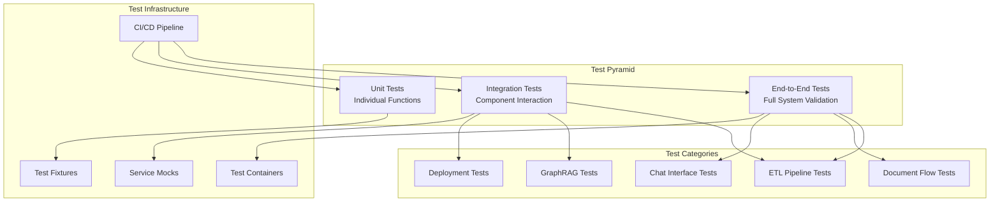

# Testing Suite - Comprehensive Testing Strategy

**Multi-layered testing approach for the Political Monitoring Agent v0.2.0 with focus on reliability and integration**

## 🎯 Testing Philosophy

Our testing strategy follows the **test pyramid** approach with emphasis on integration testing due to the distributed nature of the system. We prioritize testing real component interactions over extensive mocking.

### **Testing Principles**
- **🔗 Integration-First**: Test component interactions with minimal mocking
- **📊 High Coverage**: Target >90% coverage for business logic
- **⚡ Fast Feedback**: Quick test execution for development workflow
- **🔄 Realistic Tests**: Use real services (Neo4j, Ray) in test environment
- **📝 Clear Documentation**: Each test clearly documents what it validates

## 🏗️ Test Architecture



## 🚀 Quick Start

### **Run All Tests**
```bash
# Complete test suite
just test

# Specific test categories
just test-unit           # Unit tests only
just test-integration    # Integration tests
just test-deployment     # Deployment validation

# With coverage
just test-coverage       # Generate coverage report
```

### **Test Environment Setup**
```bash
# Ensure test services are running
just services-up

# Initialize test data
just azure-import        # Load test documents

# Verify test environment
just test-env-check      # Validate test prerequisites
```

## 📁 Test Structure

```
tests/
├── __init__.py
├── conftest.py                  # Global test configuration
├── fixtures/                   # Reusable test data
│   ├── __init__.py
│   ├── agent_test_data.py      # Chat agent test data
│   ├── documents.py            # Sample documents
│   └── etl_fixtures.py         # ETL pipeline fixtures
├── mocks/                      # Service mocks
│   ├── __init__.py
│   ├── knowledge_graph_tools.py # Graph tool mocks
│   └── memory_components.py     # Memory system mocks
├── unit/                       # Unit tests (fast, isolated)
│   ├── test_agent_base.py      # Agent base class tests
│   ├── test_etl_collectors.py  # ETL collector tests
│   ├── test_llm_base_client.py # LLM client tests
│   ├── test_models.py          # Data model tests
│   ├── test_utils_logging.py   # Utility function tests
│   └── ...
├── integration/                # Integration tests (realistic)
│   ├── test_etl_pipeline.py    # Full ETL workflow
│   ├── test_multi_agent_workflow.py # Chat system
│   ├── test_phase5_integration.py   # System integration
│   └── ...
└── deployment/                 # Deployment tests
    ├── README.md               # Deployment testing guide
    ├── conftest.py             # Deployment test config
    └── test_ray_deployment.py  # Ray cluster validation
```

## 🧪 Test Categories

### **1. Unit Tests** (`tests/unit/`)
**Purpose**: Test individual functions and classes in isolation

**Characteristics**:
- Fast execution (<10ms per test)
- Mock external dependencies
- Focus on business logic validation
- High coverage for utility functions

**Examples**:
```python
# Test data model validation
def test_document_metadata_validation():
    metadata = DocumentMetadata(
        source="test.md",
        type=DocumentType.MARKDOWN,
        file_path="/test/test.md",
        file_size_bytes=1024
    )
    assert metadata.type == DocumentType.MARKDOWN
    assert metadata.word_count == 0  # computed field

# Test utility functions
def test_extract_document_date():
    content = "Published: 2024-01-15\nContent here..."
    date = extract_document_date(content)
    assert date.strftime("%Y-%m-%d") == "2024-01-15"
```

### **2. Integration Tests** (`tests/integration/`)
**Purpose**: Test component interactions with real services

**Characteristics**:
- Medium execution time (1-30s per test)
- Use real Neo4j, Ray, and other services
- Minimal mocking of external APIs
- Focus on data flow and component integration

**Examples**:
```python
# Test ETL pipeline with real storage
async def test_etl_pipeline_full_workflow():
    collector = create_news_collector("exa_direct", test_config)
    
    # Mock only external API, test real storage
    with patch.object(collector, 'collect_news', return_value=test_articles):
        result = await collector.collect_and_store()
    
    # Verify real files were created
    files = list(Path("data/input/news").glob("*.md"))
    assert len(files) > 0

# Test multi-agent workflow with real graph
async def test_multi_agent_with_knowledge_graph():
    orchestrator = MultiAgentOrchestrator(llm=test_llm, tools=real_tools)
    
    result = await orchestrator.process_query(
        query="What is GDPR?",
        session_id="test_session"
    )
    
    assert result["success"] is True
    assert "regulation" in result["response"].lower()
```

### **3. Deployment Tests** (`tests/deployment/`)
**Purpose**: Validate system deployment and production readiness

**Characteristics**:
- Long execution time (30s-5min per test)
- Test real deployment scenarios
- Validate service health and connectivity
- Production-like environment testing

**Examples**:
```python
# Test Ray cluster deployment
def test_ray_cluster_deployment():
    # Verify Ray cluster is healthy
    assert ray.is_initialized()
    
    # Test actor deployment
    @ray.remote
    class TestActor:
        def ping(self):
            return "pong"
    
    actor = TestActor.remote()
    result = ray.get(actor.ping.remote())
    assert result == "pong"

# Test service connectivity
async def test_service_health_checks():
    services = ["neo4j", "airflow", "langfuse"]
    
    for service in services:
        health = await check_service_health(service)
        assert health.status == "healthy"
```

## 🔧 Test Configuration

### **Global Configuration** (`conftest.py`)
```python
# Essential test fixtures
@pytest.fixture(scope="session")
def setup_ray_for_tests():
    """Initialize Ray in local mode for testing."""
    if not ray.is_initialized():
        ray.init(local_mode=True, log_to_driver=False)
    yield
    ray.shutdown()

@pytest.fixture
def mock_azure_storage_client():
    """Mock Azure storage for tests."""
    with patch('src.integrations.azure_storage.AzureStorageClient') as mock:
        mock.return_value.upload_json = AsyncMock(return_value=True)
        mock.return_value.download_json = AsyncMock(return_value={"test": "data"})
        yield mock.return_value

@pytest.fixture
def mock_kodosumi_tracer():
    """Mock Kodosumi tracer for flow tests."""
    tracer = MagicMock()
    tracer.markdown = AsyncMock()
    return tracer
```

### **Test Data Fixtures** (`fixtures/`)
```python
# Document fixtures
@pytest.fixture
def sample_political_document():
    return {
        "title": "EU AI Act Implementation",
        "content": "The European Union's Artificial Intelligence Act...",
        "published_date": "2024-01-15T10:00:00Z",
        "source": "European Commission",
        "url": "https://example.com/ai-act"
    }

# ETL test fixtures
@pytest.fixture
def test_news_articles():
    return [
        {
            "title": "New Privacy Regulation Announced",
            "content": "The government announced new privacy rules...",
            "url": "https://news.example.com/privacy-reg",
            "published_date": "2024-01-15T09:00:00Z"
        }
    ]
```

## 🛠️ Development Testing

### **Test-Driven Development**
```bash
# Write test first
cat > tests/unit/test_new_feature.py << EOF
def test_new_feature():
    result = new_feature("input")
    assert result == "expected_output"
EOF

# Run test (should fail)
python -m pytest tests/unit/test_new_feature.py -v

# Implement feature
# src/module.py: implement new_feature()

# Run test again (should pass)
python -m pytest tests/unit/test_new_feature.py -v
```

### **Testing Best Practices**

#### **✅ Good Test Patterns**
```python
# Test real component interactions
async def test_document_processor_integration():
    processor = SimpleDocumentProcessor(DocumentTracker())
    
    # Use temporary directory for real file operations
    with tempfile.TemporaryDirectory() as temp_dir:
        test_file = Path(temp_dir) / "test.md"
        test_file.write_text("Test content")
        
        # Test real processing
        result = await processor.process_document(test_file, graphiti_client)
        
        # Verify real outcomes
        assert result["status"] == "success"
        assert result["entity_count"] > 0
```

#### **❌ Anti-Patterns to Avoid**
```python
# Don't over-mock internal interfaces
def test_bad_example():
    # BAD: Mocks away the code we want to test
    with patch('internal_module.important_function') as mock:
        mock.return_value = "mocked"
        result = system_under_test()
        assert result == "mocked"  # Not testing real behavior!
```

### **Debugging Failed Tests**
```bash
# Run specific test with detailed output
python -m pytest tests/unit/test_failing.py::test_specific -v -s

# Run with pdb debugger
python -m pytest tests/unit/test_failing.py::test_specific --pdb

# View test coverage for specific module
python -m pytest --cov=src.module --cov-report=html tests/unit/test_module.py
```

## 📊 Test Metrics & Coverage

### **Coverage Requirements**
- **Unit Tests**: >95% coverage for utility functions
- **Integration Tests**: >90% coverage for main workflows
- **Overall System**: >90% coverage excluding external dependencies

### **Performance Benchmarks**
- **Unit Tests**: Complete suite <30 seconds
- **Integration Tests**: Complete suite <5 minutes
- **Deployment Tests**: Complete suite <10 minutes

### **Quality Gates**
```bash
# Coverage check
just test-coverage
# Must achieve >90% overall coverage

# Performance check
just test-performance
# Must complete within time limits

# Integration check
just test-integration
# All integration tests must pass
```

## 🔄 Continuous Integration

### **CI Pipeline** (`.github/workflows/test.yml`)
```yaml
name: Test Suite
on: [push, pull_request]

jobs:
  test:
    runs-on: ubuntu-latest
    services:
      neo4j:
        image: neo4j:5
        env:
          NEO4J_AUTH: neo4j/password123
      redis:
        image: redis:alpine
    
    steps:
      - uses: actions/checkout@v4
      - uses: actions/setup-python@v4
        with:
          python-version: '3.12.6'
      
      - name: Install dependencies
        run: |
          pip install uv
          uv sync
      
      - name: Run unit tests
        run: uv run pytest tests/unit/ --cov=src
      
      - name: Run integration tests
        run: uv run pytest tests/integration/
      
      - name: Upload coverage
        uses: codecov/codecov-action@v3
```

### **Pre-commit Hooks**
```bash
# Install pre-commit hooks
pre-commit install

# Hooks run automatically on commit:
# - Code formatting (ruff)
# - Type checking (mypy)
# - Test execution (pytest)
# - Coverage validation
```

## 🚨 Troubleshooting Tests

### **Common Test Failures**

#### **Ray Initialization Issues**
```bash
# Symptoms: "Ray not initialized" errors
# Solution: Ensure Ray fixture is used
@pytest.mark.usefixtures("setup_ray_for_tests")
def test_ray_function():
    # Test code here
```

#### **Neo4j Connection Issues**
```bash
# Symptoms: Graph database connection failures
# Solution: Verify Neo4j is running and accessible
docker ps | grep neo4j
docker logs neo4j_container_name
```

#### **Async Test Issues**
```python
# Symptoms: "coroutine was never awaited" warnings
# Solution: Use pytest-asyncio properly

# Mark async tests
@pytest.mark.asyncio
async def test_async_function():
    result = await async_function()
    assert result is not None
```

#### **Fixture Dependency Issues**
```python
# Symptoms: Fixture not found errors
# Solution: Check fixture scope and dependencies

@pytest.fixture(scope="session")  # Ensure appropriate scope
def expensive_fixture():
    # Setup code
    yield fixture_value
    # Cleanup code
```

### **Test Environment Issues**
```bash
# Clean test environment
just test-clean

# Reset test database
just test-reset-db

# Verify test services
just test-services-check
```

## 📈 Test Monitoring

### **Test Analytics**
```bash
# Generate test report
just test-report

# Performance analysis
just test-profile

# Failure analysis
just test-failures
```

### **Metrics Tracking**
- **Test Success Rate**: Target >98%
- **Test Execution Time**: Track performance trends
- **Coverage Trends**: Monitor coverage over time
- **Flaky Test Detection**: Identify unstable tests

## 🔗 Component-Specific Testing

### **ETL Testing**
- **[ETL Tests](../src/etl/README.md#testing)**: Collector validation, storage integration
- **Mock Strategy**: Mock external APIs, test real storage operations
- **Focus Areas**: Data transformation, deduplication, error handling

### **Flow Testing**
- **[Flow Tests](../src/flows/README.md#testing)**: Document processing workflows
- **Mock Strategy**: Mock LLM APIs, test real Ray and Graphiti integration
- **Focus Areas**: Progress tracking, batch processing, error recovery

### **Chat Interface Testing**
- **[Chat Tests](../src/chat/README.md#testing)**: Multi-agent workflows
- **Mock Strategy**: Mock knowledge graph responses, test real agent interactions
- **Focus Areas**: Tool selection, streaming responses, session management

### **GraphRAG Testing**
- **[GraphRAG Tests](../src/graphrag/README.md#testing)**: Knowledge graph construction
- **Mock Strategy**: Mock LLM APIs, test real Neo4j operations
- **Focus Areas**: Entity extraction, relationship mapping, temporal intelligence

---

**Testing Commands Reference**:
```bash
just test              # Run all tests
just test-unit         # Unit tests only
just test-integration  # Integration tests only
just test-coverage     # Coverage report
just test-watch        # Continuous testing
just test-profile      # Performance profiling
```